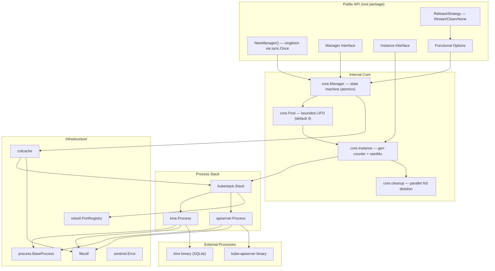
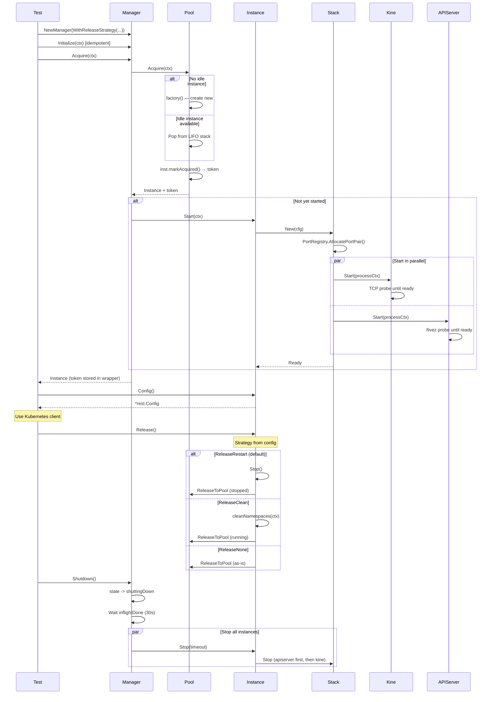
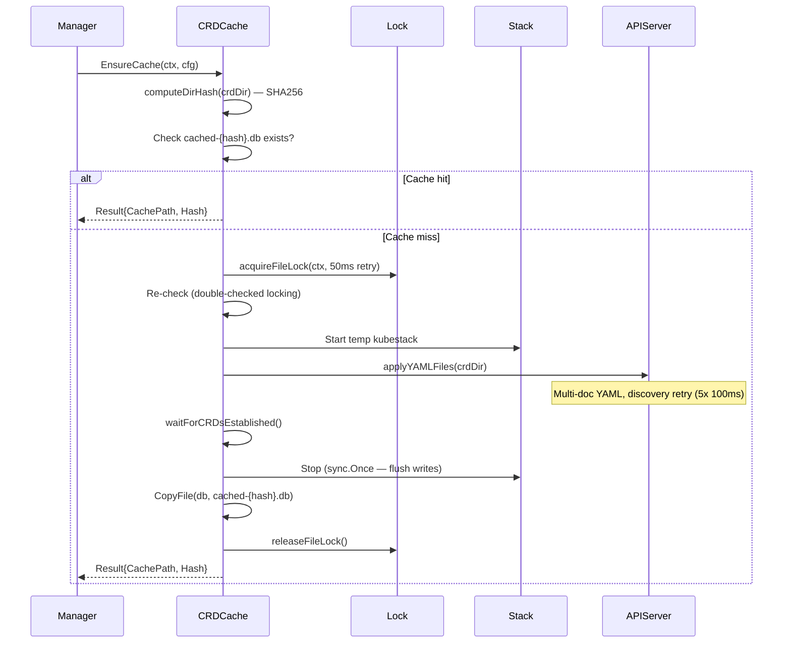
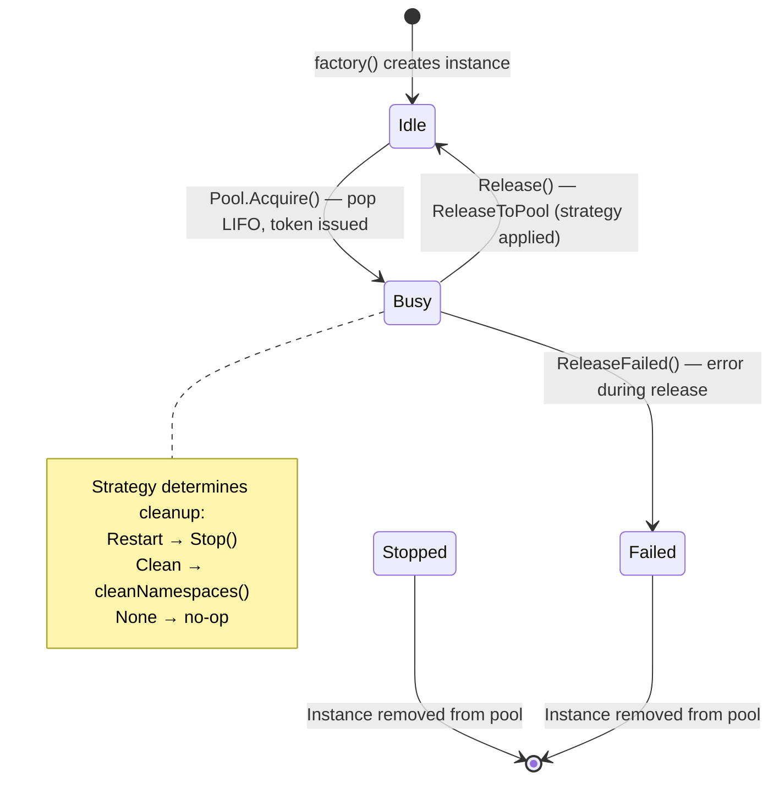

# Codebase Map

> Auto-generated by Cartographer. Last mapped: 2026-02-17

## System Overview

k8senv is a lightweight Kubernetes testing framework that manages on-demand kube-apiserver instances backed by kine (SQLite-based etcd shim) for efficient parallel test execution. Instances are created lazily, pooled for reuse, and isolated through namespaces. Release behavior is configurable via `ReleaseStrategy` (Restart, Clean, or None).



## Directory Structure

```
k8senv/
├── doc.go                     # Package documentation with usage examples
├── interfaces.go              # Manager and Instance public interfaces
├── k8senv.go                  # NewManager() singleton factory + adapter wrappers
├── options.go                 # Functional options (WithCRDDir, WithReleaseStrategy, etc.)
├── defaults.go                # Exported default constants (timeouts, binary names, strategy)
├── strategy.go                # ReleaseStrategy type alias + constants (Restart/Clean/None)
├── errors.go                  # Sentinel error re-exports from internal/core
├── config.go                  # Unexported managerConfig + conversion to core
├── log.go                     # SetLogger() public API
├── options_test.go            # Unit tests (no binaries required)
├── tests/                     # Core integration tests (package k8senv_test)
│   ├── main_test.go           # TestMain: singleton manager, default ReleaseRestart
│   ├── instance_test.go       # Instance lifecycle, API-only mode
│   ├── pool_test.go           # Pool acquire/release, concurrent access
│   ├── lifecycle_test.go      # Initialize idempotent/concurrent
│   ├── coverage_test.go       # Context cancel coverage
│   └── internal/testutil/
│       ├── testutil.go        # Shared helpers: UniqueName, AcquireWithClient, RunTestMain
│       └── stress.go          # Stress test helpers: random resource creation
├── tests/cleanup/             # Namespace cleanup tests (ReleaseClean strategy)
│   ├── main_test.go           # TestMain: singleton with WithReleaseStrategy(ReleaseClean)
│   └── cleanup_test.go        # System NS match, cleanup, preserve, fast path
├── tests/restart/             # Restart strategy tests (default ReleaseRestart)
│   ├── main_test.go           # TestMain: singleton with default strategy
│   └── restart_test.go        # Release() stops instance, next Acquire starts fresh
├── tests/stress/              # Stress tests (default ReleaseRestart)
│   ├── main_test.go           # TestMain: singleton with default strategy
│   └── stress_test.go         # 100+ parallel subtests with random resources
├── tests/stressclean/         # Stress tests (ReleaseClean strategy)
│   ├── main_test.go           # TestMain: singleton with WithReleaseStrategy(ReleaseClean)
│   └── stress_test.go         # Stress + verify clean instances on acquire
├── tests/crd/                 # CRD tests (separate package k8senv_crd_test)
│   ├── main_test.go           # TestMain: singleton with WithCRDDir
│   ├── helpers_test.go        # CRD-specific helpers + verifyCRDExists
│   ├── crd_test.go            # CRD caching, multi-doc YAML, .yml extension
│   └── testdata_test.go       # CRD YAML constants and setup helpers
├── tests/poolsize/            # Pool size tests (separate package, pool size 2)
│   ├── main_test.go           # TestMain: singleton with WithPoolSize(2)
│   └── poolsize_test.go       # Pool exhaustion, timeout, release-unblocks
├── internal/
│   ├── core/                  # Core orchestration layer
│   │   ├── config.go          # ManagerConfig, InstanceConfig, ReleaseStrategy type + Validate()
│   │   ├── config_test.go     # Canary test: field count check (12 fields)
│   │   ├── manager.go         # Manager: state machine, two-phase init, Acquire returns token
│   │   ├── pool.go            # Pool: bounded LIFO (default 4), token-based release
│   │   ├── instance.go        # Instance: gen counter, strategy-based Release()
│   │   ├── cleanup.go         # Namespace cleanup: parallel deletion, finalizer removal
│   │   └── log.go             # Package logger: atomic pointers + CAS caching
│   ├── kubestack/
│   │   └── stack.go           # Orchestrates kine + apiserver with errgroup
│   ├── apiserver/
│   │   └── process.go         # kube-apiserver: ECDSA certs, AlwaysAllow, /livez
│   ├── kine/
│   │   └── process.go         # kine: SQLite backend, optional DB prepopulation
│   ├── process/               # Process abstraction layer
│   │   ├── base.go            # BaseProcess: lifecycle, Wait goroutine, exited channel
│   │   ├── process.go         # SIGTERM → SIGKILL stop, LogFiles management
│   │   ├── stoppable.go       # Stoppable interface + generic StopCloseAndNil
│   │   ├── wait.go            # WaitReady: polling + ProcessExited fast abort
│   │   └── wait_test.go       # WaitReady unit tests
│   ├── crdcache/              # CRD cache system
│   │   ├── cache.go           # Content-addressable DB cache (EnsureCache)
│   │   ├── apply.go           # Dynamic YAML application via unstructured client
│   │   ├── apply_test.go      # Apply unit tests
│   │   ├── hash.go            # Deterministic SHA256 directory hashing
│   │   ├── hash_test.go       # Hash unit tests
│   │   ├── lock.go            # File-based locking (gofrs/flock)
│   │   └── walk.go            # Recursive YAML file discovery
│   ├── netutil/
│   │   ├── port.go            # PortRegistry: AllocatePortPair + reserve
│   │   └── port_test.go       # Port allocation tests
│   ├── fileutil/
│   │   ├── copy.go            # Atomic file copy with fsync
│   │   ├── copy_test.go       # Copy unit tests
│   │   ├── dir.go             # EnsureDir, EnsureDirForFile
│   │   └── dir_test.go        # Dir unit tests
│   └── sentinel/
│       ├── sentinel.go        # sentinel.Error: const-compatible error type
│       └── sentinel_test.go   # Sentinel unit tests
├── crds/                      # 7 Cluster API CRDs (~1.1MB, for CRD tests)
├── docs/                      # User documentation (Diataxis framework)
│   ├── README.md              # Documentation index
│   ├── tutorials/
│   │   └── getting-started.md # Installation + first test walkthrough
│   ├── how-to/
│   │   ├── crd-testing.md     # CRD pre-loading with cache
│   │   └── parallel-testing.md # Concurrent test patterns
│   ├── reference/
│   │   ├── configuration.md   # Complete option reference
│   │   ├── data-flow.md       # Request lifecycle + state diagrams
│   │   ├── directory-structure.md # File reference with purposes
│   │   └── troubleshooting.md # Common issues + debug techniques
│   ├── explanation/
│   │   └── architecture-overview.md # Design principles + rationale
│   └── CODEBASE_MAP.md        # This file
├── scripts/
│   └── download-crds.sh       # Download CRDs from upstream projects
├── Makefile                   # Main entry point, includes Makefile.*.mk
├── Makefile.dev.mk            # Dev targets (build, fmt, lint, deps)
├── Makefile.test.mk           # Test targets: two-phase (non-stress then stress)
├── Makefile.tools.mk          # Tool install targets (kine, kube-apiserver, golangci-lint)
├── .golangci.yml              # 55 enabled linters across 11 tiers
├── go.mod                     # Module: github.com/giantswarm/k8senv (Go 1.25)
└── go.sum
```

## Module Guide

### Public API (root package `k8senv`)

**Purpose**: Thin facade exposing interfaces, factory, options, strategy, and errors. All implementation delegated to `internal/core`.

**Entry point**: `k8senv.go` (`NewManager()` — process-level singleton via `sync.Once`)

| File | Purpose | Tokens |
|------|---------|--------|
| `interfaces.go` | `Manager` and `Instance` interfaces | 702 |
| `k8senv.go` | `NewManager()` singleton factory + adapter wrappers | 1022 |
| `options.go` | 12 functional options with panic-on-invalid validation | 1567 |
| `strategy.go` | `ReleaseStrategy` type alias + 3 constants (Restart/Clean/None) | 221 |
| `defaults.go` | Exported default constants (timeouts, binary names, strategy) | 577 |
| `errors.go` | 7 sentinel errors re-exported from `internal/core` | 297 |
| `config.go` | Unexported `managerConfig` + conversion to `core.ManagerConfig` | 103 |
| `log.go` | `SetLogger()` for custom logging | 194 |
| `doc.go` | Package documentation with examples | 447 |

**Key exports**:
```go
// Release Strategy
type ReleaseStrategy = core.ReleaseStrategy  // type alias
const ReleaseRestart, ReleaseClean, ReleaseNone

// Interfaces
type Manager interface { Initialize(ctx) error; Acquire(ctx) (Instance, error); Shutdown() error }
type Instance interface { Config() (*rest.Config, error); Release() error; ID() string }

// Factory (singleton — first call creates, subsequent calls return same instance)
func NewManager(opts ...ManagerOption) Manager

// Options (all panic on invalid input)
func WithPoolSize(int) ManagerOption
func WithReleaseStrategy(ReleaseStrategy) ManagerOption   // NEW
func WithCleanupTimeout(time.Duration) ManagerOption      // NEW
func WithKineBinary(string) ManagerOption
func WithKubeAPIServerBinary(string) ManagerOption
func WithAcquireTimeout(time.Duration) ManagerOption
func WithPrepopulateDB(string) ManagerOption
func WithCRDDir(string) ManagerOption
func WithBaseDataDir(string) ManagerOption
func WithCRDCacheTimeout(time.Duration) ManagerOption
func WithInstanceStartTimeout(time.Duration) ManagerOption
func WithInstanceStopTimeout(time.Duration) ManagerOption

// Defaults
const DefaultReleaseStrategy = ReleaseRestart             // NEW
const DefaultCleanupTimeout = 30 * time.Second            // NEW

// Errors (sentinel.Error — compatible with errors.Is)
var ErrShuttingDown, ErrNotInitialized, ErrPoolClosed, ErrInstanceReleased,
    ErrNotStarted, ErrNoYAMLFiles, ErrMissingKind error

// Logging
func SetLogger(*slog.Logger)
```

**Pattern**: Adapter pattern wraps `internal/core` types into public interfaces via unexported `managerWrapper`/`instanceWrapper`. Token from `Acquire` is stored in the wrapper and passed to `Release()` internally — callers never see it.

---

### internal/core — Core Orchestration

**Purpose**: Implements Manager, Pool, and Instance with atomic state, lazy initialization, strategy-based release, and on-demand instance creation.

| File | Purpose | Tokens |
|------|---------|--------|
| `manager.go` | State machine (atomic), two-phase init, Acquire returns token, parallel shutdown | 4790 |
| `pool.go` | Bounded LIFO pool (default 4), semaphore, token-based double-release detection | 2146 |
| `instance.go` | Instance lifecycle: strategy-based Release(), gen counter, startMu, retry on port conflict | 4724 |
| `cleanup.go` | Namespace cleanup: parallel deletion (limit 10), finalizer removal, confirmations | 2253 |
| `config.go` | `ManagerConfig`, `InstanceConfig`, `ReleaseStrategy` type with `Validate()` | 2090 |
| `config_test.go` | Canary test: reflection-based field count check (12 fields) | 2106 |
| `log.go` | Package logger: dual atomic pointers + CAS caching | 633 |

**ReleaseStrategy** (defined in `config.go`):
```go
type ReleaseStrategy int
const (
    ReleaseRestart ReleaseStrategy = iota  // Stop instance, DB restored from template on next acquire
    ReleaseClean                           // Delete non-system namespaces, keep running
    ReleaseNone                            // No cleanup, return as-is
)
```

**Release flow** (`instance.go`):
```
Release(token) → validate token (CAS) → switch strategy:
  ReleaseRestart → Stop() → ReleaseFailed or ReleaseToPool
  ReleaseClean   → cleanNamespaces() → ReleaseFailed or ReleaseToPool
  ReleaseNone    → ReleaseToPool (no cleanup)
```

**Key interactions**:
- `Manager` uses atomic state machine: `created -> initializing -> ready -> shuttingDown`
- `Manager.Acquire()` returns `(*Instance, token uint64, error)` — token enables double-release detection
- `Pool` creates instances on demand via factory; LIFO stack for cache locality
- `Instance` uses generation counter (atomic uint64, odd=acquired/even=free) with `startMu` serializing Start/Stop
- `cleanup.go` handles namespace cleanup with parallel deletion, finalizer removal (no controller-manager), and confirmation polling

**Concurrency model**:
- `state atomic.Uint32` — Fast state checks in Manager
- `pool atomic.Pointer[Pool]` — Lock-free pool reads on Acquire hot path
- `inflight atomic.Int64` + `inflightDone chan` — Drain pattern for shutdown vs in-flight releases
- `initMu sync.Mutex` — Serializes concurrent Initialize calls only
- `gen atomic.Uint64` — Generation counter for ABA prevention on double-release
- `started atomic.Bool` — Lock-free Instance state
- Lock independence: `inflight` is atomic (not a lock); `initMu` is used only during Initialize

---

### internal/kubestack — Process Stack

**Purpose**: Orchestrates coordinated kine + kube-apiserver startup/shutdown as a single unit.

| File | Purpose | Tokens |
|------|---------|--------|
| `stack.go` | Two-process lifecycle with errgroup, two-context pattern, retry on port conflict | 3480 |

**Startup**: `errgroup.WithContext` starts kine and apiserver in parallel. Kine waits for TCP readiness, apiserver waits for `/livez`. Two-context pattern: `processCtx` (Background) for process lifetime, `readyCtx` (caller) for startup timeout.

**Shutdown**: Reverse order (apiserver first, then kine). Each process gets full timeout (not shared). Uses `errors.Join` for multiple failures.

**Port allocation**: Delegates to `PortRegistry.AllocatePortPair()` for two distinct ports. `StartWithRetry` creates fresh Stack on port conflicts.

---

### internal/apiserver — kube-apiserver Process

**Purpose**: Manages kube-apiserver with self-signed certs, AlwaysAllow auth, and health monitoring.

| File | Purpose | Tokens |
|------|---------|--------|
| `process.go` | ECDSA P-256 certs, AlwaysAllow authz, parallel file prep, `/livez` health check | 3322 |

**Key decisions**: ECDSA P-256 (<1ms vs RSA 2048 ~50-200ms). `AlwaysAllow` authorization (skips RBAC startup, ~6s saved). `/livez` instead of `/readyz` (skips slow post-start hooks, ~6-7s saved). `--watch-cache=false` for immediate consistency. Anonymous health endpoints via `AuthenticationConfiguration`. `DisableKeepAlives` in HTTP client prevents connection accumulation.

**Parallel file prep**: Token file, certificates, and auth config generated concurrently via errgroup.

---

### internal/kine — kine Process

**Purpose**: Manages kine (etcd-compatible SQLite shim) process.

| File | Purpose | Tokens |
|------|---------|--------|
| `process.go` | SQLite backend, optional DB prepopulation, TCP readiness probe | 1270 |

**Key behavior**: Copies cached DB at construction time (not startup). Disables metrics server (`--metrics-bind-address=0`) to avoid port conflicts. Readiness check via TCP dial (no HTTP endpoint).

---

### internal/process — Process Abstraction

**Purpose**: Generic process lifecycle management with composition-based reuse.

| File | Purpose | Tokens |
|------|---------|--------|
| `base.go` | `BaseProcess`: lifecycle, single Wait goroutine, exited broadcast channel | 1272 |
| `process.go` | SIGTERM -> SIGKILL stop (5s grace), LogFiles management | 1694 |
| `stoppable.go` | `Stoppable` interface + generic `StopCloseAndNil[P, E]` | 421 |
| `wait.go` | `WaitReady`: polling with `ProcessExited` channel for fast abort | 613 |
| `wait_test.go` | WaitReady unit tests | 997 |

**Layer hierarchy**:
```
Stoppable interface
    ^
BaseProcess (embeddable)
    ^
├── kine.Process
└── apiserver.Process
```

**Process death detection**: `WaitReady` accepts `ProcessExited <-chan struct{}` — checked before each readiness attempt for fast abort if process dies during startup.

**Stop sequence**: SIGTERM -> 5s grace (capped at total timeout) -> SIGKILL -> 10s hard drain on Wait channel. `SysProcAttr.Pdeathsig = SIGTERM` ensures child dies if parent dies.

---

### internal/crdcache — CRD Cache System

**Purpose**: Content-addressable caching of CRD-populated SQLite databases for fast instance startup.

| File | Purpose | Tokens |
|------|---------|--------|
| `cache.go` | `EnsureCache`: double-checked locking, temp stack, sync.Once stop | 3610 |
| `apply.go` | Dynamic YAML application: multi-doc, discovery retry (5 attempts, 100ms backoff) | 2779 |
| `apply_test.go` | Apply unit tests | 1523 |
| `hash.go` | Deterministic SHA256 hash (first 16 hex chars) of sorted YAML files | 472 |
| `hash_test.go` | Hash unit tests | 2047 |
| `lock.go` | File-based locking via `gofrs/flock` (50ms retry interval) | 473 |
| `walk.go` | Recursive sorted YAML file discovery (.yaml/.yml) | 193 |

**Cache flow**: `computeDirHash(crdDir)` -> check `cached-{hash}.db` -> if miss: acquire file lock -> re-check (double-checked locking) -> spin up temp kubestack -> apply CRDs -> wait for Established condition -> stop stack (flush writes) -> copy DB -> release lock.

**CRD apply**: Uses dynamic client with unstructured resources. Discovery retry with backoff for CRD registration propagation. Non-caching discovery client required for fresh API requests. `maxYAMLFiles=1000` guards against misconfiguration.

---

### internal/netutil — Network Utilities

| File | Purpose | Tokens |
|------|---------|--------|
| `port.go` | `PortRegistry`: `AllocatePortPair()`, reserve/release tracking | 1094 |
| `port_test.go` | Port allocation tests | 1883 |

**Port allocation**: Both listeners held open simultaneously (guarantees distinct ports). Registry tracks in-use ports to prevent TOCTOU. Retry on duplicate (maxPortRetries=20). Must release ports manually; no finalizer cleanup.

---

### internal/fileutil — File Utilities

| File | Purpose | Tokens |
|------|---------|--------|
| `copy.go` | `CopyFile` with atomic write (temp + rename), optional fsync | 1077 |
| `copy_test.go` | Copy unit tests | 2124 |
| `dir.go` | `EnsureDir`, `EnsureDirForFile` (idempotent mkdir) | 175 |
| `dir_test.go` | Dir unit tests | 771 |

---

### internal/sentinel — Sentinel Errors

| File | Purpose | Tokens |
|------|---------|--------|
| `sentinel.go` | `sentinel.Error` string type: const-compatible, `errors.Is` compatible | 119 |
| `sentinel_test.go` | Sentinel unit tests | 550 |

---

### Tests

**Seven test packages** with distinct singleton managers and release strategies:

| Package | Strategy | Pool Size | Purpose |
|---------|----------|-----------|---------|
| `tests/` | `ReleaseRestart` (default) | dynamic | Core integration tests |
| `tests/cleanup/` | `ReleaseClean` | dynamic | Namespace cleanup verification |
| `tests/restart/` | `ReleaseRestart` (default) | dynamic | Instance restart verification |
| `tests/stress/` | `ReleaseRestart` (default) | dynamic | High-volume parallel stress |
| `tests/stressclean/` | `ReleaseClean` | dynamic | Stress with namespace cleanup |
| `tests/crd/` | `ReleaseRestart` (default) | dynamic | CRD pre-loading tests |
| `tests/poolsize/` | `ReleaseRestart` (default) | 2 (fixed) | Bounded pool behavior |

**`tests/` (package `k8senv_test`)** — Core integration tests:

| File | Tests | Purpose |
|------|-------|---------|
| `main_test.go` | -- | TestMain: singleton manager, binary validation, signal handling |
| `instance_test.go` | 6 | BasicUsage, Reuse, IDUniqueness, DoubleRelease, APIOnly, MultiInstance |
| `pool_test.go` | 3 | AcquireRelease, ConcurrentAccess, ParallelAcquisition (10 goroutines) |
| `lifecycle_test.go` | 2 | InitializeIdempotent, InitializeConcurrent |
| `coverage_test.go` | 1 | ContextCancelDuringAcquire |

**`tests/cleanup/` (package `k8senv_cleanup_test`)** — Namespace cleanup with `ReleaseClean`:

| File | Tests | Purpose |
|------|-------|---------|
| `main_test.go` | -- | TestMain: singleton with `WithReleaseStrategy(ReleaseClean)` |
| `cleanup_test.go` | 4 | SystemNamespacesMatch, CleanupNamespaces, PreserveSystemNS, NoUserNamespaces |

**`tests/restart/` (package `k8senv_restart_test`)** — Instance restart with default `ReleaseRestart`:

| File | Tests | Purpose |
|------|-------|---------|
| `main_test.go` | -- | TestMain: singleton with default strategy |
| `restart_test.go` | 1 | ReleaseRestart: stop instance, next Acquire starts fresh |

**`tests/stress/` (package `k8senv_stress_test`)** — Stress tests with default strategy:

| File | Tests | Purpose |
|------|-------|---------|
| `main_test.go` | -- | TestMain: singleton with default strategy |
| `stress_test.go` | 1 | 100+ parallel subtests with random resource creation |

**`tests/stressclean/` (package `k8senv_stressclean_test`)** — Stress tests with `ReleaseClean`:

| File | Tests | Purpose |
|------|-------|---------|
| `main_test.go` | -- | TestMain: singleton with `WithReleaseStrategy(ReleaseClean)` |
| `stress_test.go` | 1 | Stress + verify clean instances on acquire |

**`tests/crd/` (package `k8senv_crd_test`)** — CRD tests with `WithCRDDir`:

| File | Tests | Purpose |
|------|-------|---------|
| `main_test.go` | -- | TestMain: singleton with CRD directory |
| `helpers_test.go` | -- | CRD helpers + verifyCRDExists (apiextensions client) |
| `crd_test.go` | 5 | Caching, MultipleCRDs, CRAndInstance, MultiDocumentYAML, YmlExtension |
| `testdata_test.go` | -- | CRD YAML constants and `setupSharedCRDDir()` |

**`tests/poolsize/` (package `k8senv_poolsize_test`)** — Bounded pool tests with `WithPoolSize(2)`:

| File | Tests | Purpose |
|------|-------|---------|
| `main_test.go` | -- | TestMain: singleton with fixed pool size 2 |
| `poolsize_test.go` | 3 | PoolTimeout (exhaustion), ReleaseUnblocks, BoundedInstanceReuse |

**`tests/internal/testutil/`** — Shared helpers across all test packages:

| Function | Purpose |
|----------|---------|
| `UniqueName(prefix)` | Atomic counter for unique resource names |
| `TestParallel()` | Returns effective `-test.parallel` value |
| `AcquireWithClient(ctx, t, mgr)` | Acquires instance + creates k8s client |
| `SetupTestLogging()` | Configures slog from `K8SENV_LOG_LEVEL` |
| `RequireBinariesOrExit()` | Validates kine/kube-apiserver in PATH |
| `RunTestMain(m, mgr, tmpDir)` | Signal handling + cleanup lifecycle |
| `SystemNamespaces()` | Returns copy of system namespace set |
| `StressSubtestCount()` | Returns stress subtest count from env |
| `StressCreateRandomResource()` | Creates random K8s resource for stress tests |

**Key patterns**: `t.Parallel()` everywhere (except poolsize tests). Unique namespaces via atomic counter. Table-driven panic tests. Race detector compatible. Poolsize tests are sequential to control pool state precisely. Stress tests run in separate phase after non-stress tests.

---

### Build & Configuration

| File | Purpose |
|------|---------|
| `Makefile` | Main entry, help system, includes `Makefile.*.mk` |
| `Makefile.dev.mk` | Dev targets: `build`, `fmt`, `lint`, `lint-fix`, `deps` |
| `Makefile.test.mk` | Two-phase test execution: non-stress (parallel) then stress (sequential) |
| `Makefile.tools.mk` | Tool installs: kine, kube-apiserver, golangci-lint, pkgsite; `docs` server |
| `go.mod` | `github.com/giantswarm/k8senv`, Go 1.25, K8s client-go v0.35.1 |
| `.golangci.yml` | 55 linters across 11 tiers (static analysis, security, style, complexity) |

**Test execution** (two-phase, from `Makefile.test.mk`):
1. **Phase 1**: Non-stress packages — run in parallel across packages
2. **Phase 2**: Stress packages — `tests/stress` then `tests/stressclean` sequentially

**Test options** (override on command line):
- `RACE=1` — Enable race detector
- `NOCACHE=1` — Disable test cache
- `TEST=TestName` — Run specific test
- `LOG_LEVEL=DEBUG` — Set log verbosity
- `PARALLEL=N` — Parallel test count (default: 8)
- `STRESS_SUBTESTS=N` — Override stress subtest count (default: 100)

**Direct dependencies**: `gofrs/flock`, `k8s.io/api`, `k8s.io/apiextensions-apiserver`, `k8s.io/apimachinery`, `k8s.io/client-go` (all v0.35.1), `golang.org/x/sync/errgroup`.

---

### Documentation (Diataxis Framework)

| Category | File | Purpose |
|----------|------|---------|
| Tutorial | `tutorials/getting-started.md` | Installation + first test walkthrough |
| How-To | `how-to/parallel-testing.md` | Concurrent test patterns with namespace isolation |
| How-To | `how-to/crd-testing.md` | CRD pre-loading with hash-based cache |
| Reference | `reference/configuration.md` | Complete option reference with defaults |
| Reference | `reference/data-flow.md` | Request lifecycle + state machine diagrams |
| Reference | `reference/directory-structure.md` | File reference with purposes |
| Reference | `reference/troubleshooting.md` | Common issues + debug techniques |
| Explanation | `explanation/architecture-overview.md` | Design principles + technology rationale |

---

## Data Flow

### Test Lifecycle



### CRD Cache Creation



### Pool State Machine



## Conventions

**Naming**:
- Interfaces in root package, implementations in `internal/`
- Functional options: `With[Setting](value) ManagerOption` (panic on invalid)
- Sentinel errors: `Err[Condition]` (e.g., `ErrShuttingDown`) — `const` via `sentinel.Error`
- Process types: `[Name].Process` with embedded `BaseProcess`
- Instance IDs: `inst-{index}-{8-hex-chars}`
- Release strategies: `Release[Behavior]` (e.g., `ReleaseRestart`, `ReleaseClean`, `ReleaseNone`)

**Concurrency**:
- Prefer atomics for fast reads (`gen`, `started`, `state`)
- Mutex only for complex state (Pool, PortRegistry)
- Generation counter (atomic uint64) for ABA prevention on double-release
- Atomic counters for TOCTOU guards (inflight)
- `sync.Once` for singletons (Manager, PortRegistry, logger cache)
- `errgroup.WithContext` for parallel operations

**Error handling**:
- Sentinel errors for caller-facing conditions (`errors.Is()` compatible)
- `fmt.Errorf("context: %w", err)` wrapping throughout
- `errors.Join()` for collecting multiple errors (validation, shutdown)
- Panics only for programmer errors (invalid options, double-release, nil factory)

**Testing**:
- All tests are integration tests (`//go:build integration`)
- External package pattern (`k8senv_test`) — only public API tested
- Tests fail (not skip) if binaries missing
- `t.Parallel()` for concurrent tests, `t.Cleanup()` for deferred teardown
- Seven test packages with separate singletons, strategy-specific configuration
- Two-phase test execution: non-stress packages first, stress packages sequentially
- Shared helpers consolidated in `tests/internal/testutil/`

**Logging**:
- `log/slog` throughout (structured logging)
- Package logger with `"component": "k8senv"` attribute
- Instance loggers add `"id": instanceID`
- Atomic pointer + CAS for lock-free logger access
- `K8SENV_LOG_LEVEL` env var for test verbosity

**Lint**:
- 55 linters enabled in `.golangci.yml` across 11 tiers
- Cyclomatic complexity: 15, Cognitive complexity: 20
- `//nolint:linter // justification` required for suppressions
- Test files exclude: gocyclo, gocognit, dupl, goconst, unparam, forcetypeassert

## Gotchas

1. **Manager is a process-level singleton** — `NewManager()` uses `sync.Once`. Options are ignored after the first call (logs warning). Cannot be reset without process restart.

2. **ReleaseStrategy is manager-level, not per-call** — Strategy is configured once via `WithReleaseStrategy()` and applies to all instances. Cannot be changed per-release call. This is intentional for consistency.

3. **AcquireTimeout covers pool wait + instance startup** — with a bounded pool (default: 4), Acquire may block waiting for a free instance before creating or reusing one. The timeout covers both wait time and startup (~5-15s). Default 30s is sufficient for most cases; increase if pool contention is expected.

4. **Lazy initialization** — first `Acquire()` on each instance pays startup cost. Subsequent acquires of a reused instance may be instant (ReleaseClean/ReleaseNone) or pay startup again (ReleaseRestart).

5. **Token-based double-release detection** — `Acquire()` internally issues a token (generation counter). `Release()` validates the token via CAS. Calling `Release()` twice triggers a panic (programmer error).

6. **Config() has TOCTOU window** — the generation check in `Config()` is a defensive guard, not a concurrency guarantee. Documented as intentional (caller error if racing with Release).

7. **Port allocation TOCTOU** — ports from kernel may be claimed before use. Mitigated by PortRegistry (prevents internal conflicts) and `StartWithRetry` (creates fresh Stack on port conflict, up to 5 retries).

8. **Two-context pattern in Stack** — `processCtx` (Background) keeps processes alive across test boundaries; `readyCtx` (caller) only gates startup timeout.

9. **API-only mode** — no scheduler or controller-manager. Pods remain Pending. Controllers don't reconcile. Finalizers must be removed manually during cleanup.

10. **Cached logger doesn't track slog.SetDefault()** — the cached default logger is set once via CAS. Call `SetLogger(nil)` to force a refresh.

11. **CRD cache first run** — spins up a temporary kubestack, applies CRDs, waits for Established condition, copies the DB. Can take 30+ seconds. Subsequent runs use cached DB instantly.

12. **Lock independence** — Manager: `inflight` is atomic (not a lock); `initMu` is used only during Initialize. Pool reads use `atomic.Pointer`, removing lock-ordering constraints.

13. **Stop timeout is per-process** — Stack stops apiserver then kine sequentially. Worst-case total = 2 * timeout.

14. **CRD apply discovery retry** — `missingKindErr` detection uses string matching because upstream `NoKindMatchError` doesn't implement `Unwrap`.

15. **Namespace cleanup requires finalizer removal** — API-only mode has no controller-manager, so namespace finalizers must be removed via Finalize subresource before deletion completes.

16. **Stress tests run in separate phase** — `Makefile.test.mk` runs stress packages (`tests/stress`, `tests/stressclean`) sequentially after all other packages to avoid resource exhaustion.

## Navigation Guide

**To add a new functional option**: Edit `options.go` — add a `With[Name]` function. Wire through `config.go` (root), `internal/core/config.go` (core), and `k8senv.go` (defaults). Update `config_test.go` field count canary.

**To add a new release strategy**: Add constant to `internal/core/config.go` (`ReleaseStrategy` enum). Update `IsValid()` and `String()`. Add case in `internal/core/instance.go:Release()`. Re-export in `strategy.go`. Add test package under `tests/`.

**To add a new process type**: Create `internal/[name]/process.go`, embed `process.BaseProcess`, implement `Start(ctx)` and readiness check. Wire into `kubestack/stack.go` for coordinated lifecycle.

**To modify instance startup**: Edit `internal/core/instance.go` (`Start` method) and `internal/kubestack/stack.go` (`Start` method).

**To change pool behavior**: Edit `internal/core/pool.go` — `Acquire`, `Release`, or `ReleaseFailed` methods.

**To add an integration test**: Add to appropriate file in `tests/` with `//go:build integration` tag. Use `sharedManager.Acquire()`, `testutil.UniqueName()`, `t.Parallel()`.

**To add a strategy-specific test**: Create new package under `tests/[name]/` with `main_test.go` (configure strategy in TestMain) and `[name]_test.go`.

**To add a CRD test**: Add to `tests/crd/crd_test.go`. Define CRD YAML in `testdata_test.go`, add file creation in `setupSharedCRDDir()`.

**To add a pool exhaustion test**: Add to `tests/poolsize/poolsize_test.go`. Do NOT use `t.Parallel()` — these tests need exclusive pool access.

**To modify CRD caching**: Edit files in `internal/crdcache/` — `cache.go` for flow, `apply.go` for resource application, `hash.go` for cache key.

**To change kube-apiserver flags**: Edit `internal/apiserver/process.go` — modify `exec.Command` args in `Start()`.

**To change kine flags**: Edit `internal/kine/process.go` — modify `exec.Command` args in `Start()`.

**To add a linter**: Edit `.golangci.yml` — add to appropriate tier in `enable` list, configure in `settings`, add exclusions if needed.
