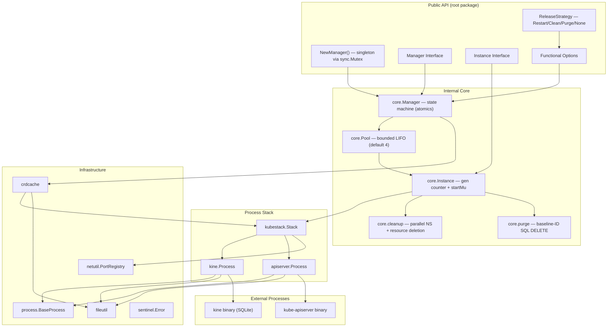
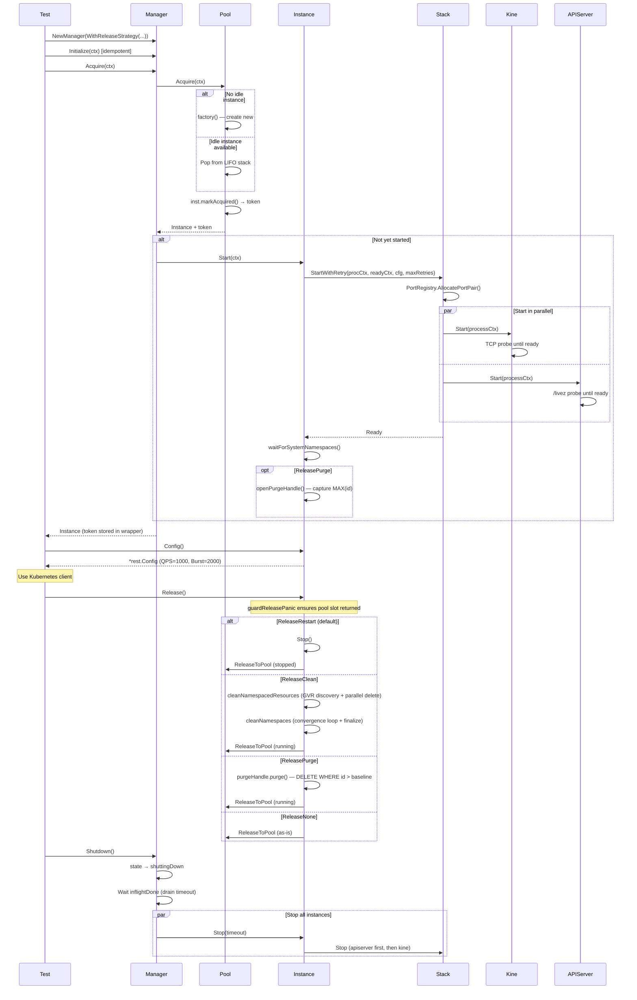
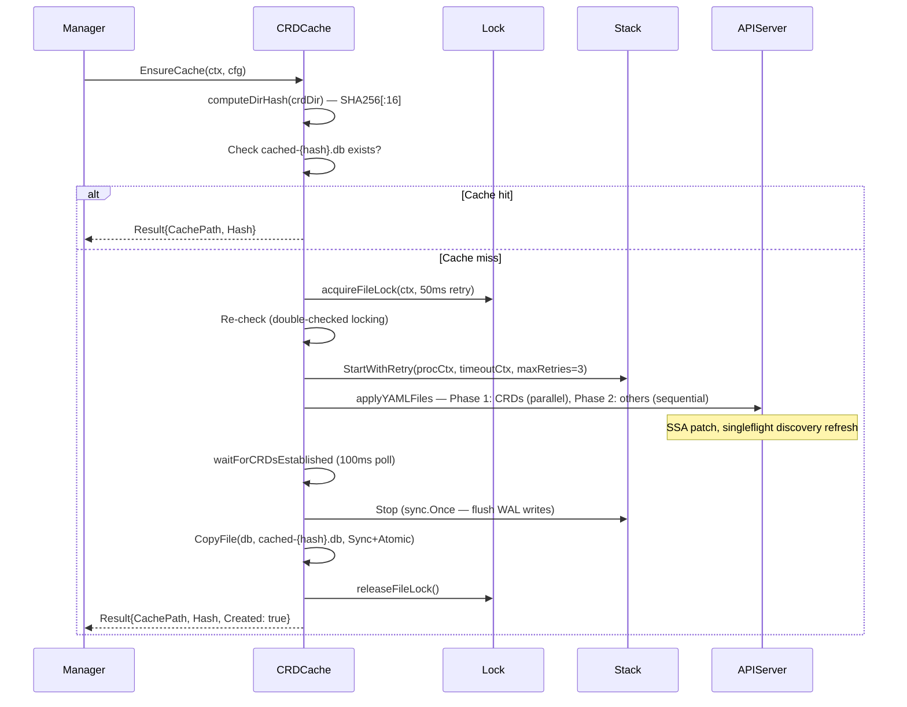
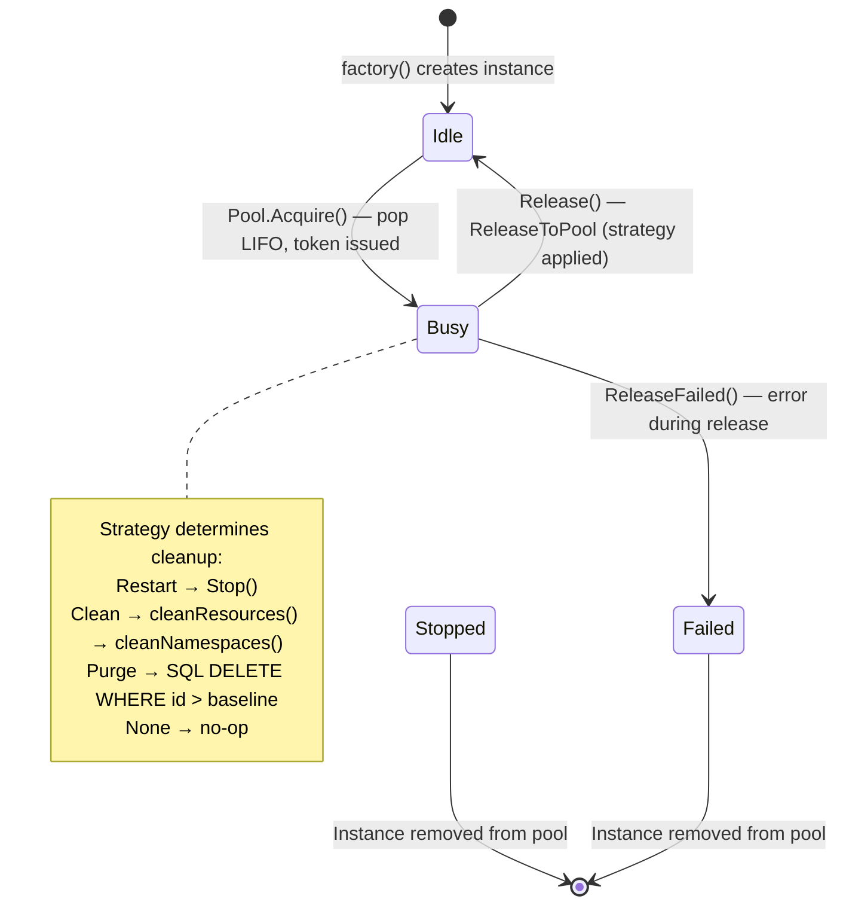

# Codebase Map

> Auto-generated by Cartographer. Last mapped: 2026-03-02

## System Overview

k8senv is a lightweight Kubernetes testing framework that manages on-demand kube-apiserver instances backed by kine (SQLite-based etcd shim) for efficient parallel test execution. Instances are created lazily, pooled for reuse, and isolated through namespaces. Release behavior is configurable via `ReleaseStrategy` (Restart, Clean, Purge, or None).


```mermaid
graph TB
    subgraph "Public API (root package)"
        Factory["NewManager() — singleton via sync.Mutex"]
        MI[Manager Interface]
        II[Instance Interface]
        Opts[Functional Options]
        Strat["ReleaseStrategy — Restart/Clean/Purge/None"]
    end

    subgraph "Internal Core"
        Mgr["core.Manager — state machine (atomics)"]
        Pool["core.Pool — bounded LIFO (default 4)"]
        Inst["core.Instance — gen counter + startMu"]
        Clean["core.cleanup — parallel NS + resource deletion"]
        Purge["core.purge — baseline-ID SQL DELETE"]
    end

    subgraph "Process Stack"
        Stack[kubestack.Stack]
        Kine[kine.Process]
        API[apiserver.Process]
    end

    subgraph "Infrastructure"
        Proc[process.BaseProcess]
        Net["netutil.PortRegistry"]
        File[fileutil]
        CRD[crdcache]
        Sentinel[sentinel.Error]
    end

    subgraph "External Processes"
        KineBin["kine binary (SQLite)"]
        APIBin["kube-apiserver binary"]
    end

    Factory --> Mgr
    MI --> Mgr
    II --> Inst
    Opts --> Mgr
    Strat --> Opts

    Mgr --> Pool
    Pool --> Inst
    Inst --> Stack
    Inst --> Clean
    Inst --> Purge

    Stack --> Kine
    Stack --> API
    Stack --> Net

    Kine --> Proc
    API --> Proc
    Kine --> File
    API --> File

    Kine --> KineBin
    API --> APIBin

    Mgr --> CRD
    CRD --> Stack
    CRD --> File
```

## Directory Structure

```
k8senv/
├── doc.go                     # Package documentation with usage examples
├── interfaces.go              # Manager and Instance public interfaces
├── k8senv.go                  # NewManager() singleton factory + adapter wrappers
├── options.go                 # 13 functional options with panic-on-invalid validation
├── defaults.go                # Exported default constants (timeouts, binary names, strategy)
├── strategy.go                # ReleaseStrategy type alias + constants (Restart/Clean/Purge/None)
├── errors.go                  # 9 sentinel error re-exports from internal/core
├── config.go                  # Unexported managerConfig + conversion to core
├── log.go                     # SetLogger() public API
├── namespace.go               # SystemNamespaceNames() public API
├── export_test.go             # Test-only exports: ConfigSnapshot, ResetForTesting
├── errors_test.go             # Sentinel error identity, distinctness, wrappability
├── options_test.go            # Unit tests (no binaries required)
├── namespace_test.go          # Copy semantics of SystemNamespaceNames
├── strategy_test.go           # Reflection-based method count canary
├── tests/                     # Core integration tests (package k8senv_test)
│   ├── main_test.go           # TestMain: singleton manager, default ReleaseRestart
│   ├── instance_test.go       # Instance lifecycle, API-only mode
│   ├── pool_test.go           # Pool acquire/release, concurrent access
│   ├── lifecycle_test.go      # Initialize idempotent/concurrent
│   ├── context_test.go        # Context cancel coverage
│   └── internal/testutil/
│       ├── testutil.go        # SetupAndRun, AcquireWithClient, UniqueName, RunTestMain
│       ├── release.go         # Shared release assertion helpers (cleanup + purge)
│       └── stress.go          # Stress test helpers: random resource creation, canary
├── tests/cleanup/             # Namespace cleanup tests (ReleaseClean strategy)
│   ├── main_test.go           # TestMain: singleton with WithReleaseStrategy(ReleaseClean)
│   └── cleanup_test.go        # System NS match, cleanup, preserve, resources, finalizers
├── tests/purge/               # SQLite purge tests (ReleasePurge strategy)
│   ├── main_test.go           # TestMain: singleton with WithReleaseStrategy(ReleasePurge)
│   └── purge_test.go          # Purge NS, preserve system NS, resources, finalizers
├── tests/restart/             # Restart strategy tests (default ReleaseRestart)
│   ├── main_test.go           # TestMain: singleton with default strategy
│   └── restart_test.go        # Release() stops instance, next Acquire starts fresh
├── tests/stress/              # Stress tests (default ReleaseRestart)
│   ├── main_test.go           # TestMain: singleton with default strategy
│   └── stress_test.go         # 100+ parallel subtests with canary verification
├── tests/stressclean/         # Stress tests (ReleaseClean strategy)
│   ├── main_test.go           # TestMain: singleton with WithReleaseStrategy(ReleaseClean)
│   └── stress_test.go         # Stress + verify clean instances on acquire
├── tests/stresspurge/         # Stress tests (ReleasePurge strategy)
│   ├── main_test.go           # TestMain: singleton with WithReleaseStrategy(ReleasePurge)
│   └── stress_test.go         # Stress + verify clean instances via SQL purge
├── tests/crd/                 # CRD tests (separate package k8senv_crd_test)
│   ├── main_test.go           # TestMain: singleton with WithCRDDir (via SetupHook)
│   ├── helpers_test.go        # verifyCRDExists helper
│   ├── crd_test.go            # CRD caching, multi-doc YAML, .yml extension
│   ├── testdata_test.go       # setupSharedCRDDir helper
│   └── testdata/              # 6 test CRD files (.yaml/.yml)
├── tests/poolsize/            # Pool size tests (separate package, pool size 2)
│   ├── main_test.go           # TestMain: singleton with WithPoolSize(2)
│   └── poolsize_test.go       # Pool exhaustion, timeout, release-unblocks
├── internal/
│   ├── core/                  # Core orchestration layer
│   │   ├── doc.go             # Package documentation
│   │   ├── config.go          # ManagerConfig (13 fields), InstanceConfig (8 fields), ReleaseStrategy
│   │   ├── config_test.go     # Canary tests: field counts (13 + 8)
│   │   ├── manager.go         # Manager: state machine, two-phase init, inflight drain
│   │   ├── pool.go            # Pool: bounded LIFO, semaphore, token-based release
│   │   ├── pool_test.go       # Pool unit tests
│   │   ├── instance.go        # Instance: gen counter, clientCache CAS, guardReleasePanic
│   │   ├── instance_test.go   # Instance unit tests
│   │   ├── cleanup.go         # ReleaseClean: GVR discovery, parallel deletion, finalizer removal
│   │   ├── cleanup_test.go    # Cleanup unit tests
│   │   ├── purge.go           # ReleasePurge: baseline-ID SQL DELETE, prepared statement
│   │   ├── purge_test.go      # Purge unit tests
│   │   └── log.go             # Package logger: dual atomic pointers + CAS caching
│   ├── kubestack/
│   │   ├── doc.go             # Package documentation
│   │   └── stack.go           # Orchestrates kine + apiserver with errgroup
│   ├── apiserver/
│   │   ├── doc.go             # Package documentation
│   │   └── process.go         # kube-apiserver: ECDSA certs, AlwaysAllow, /livez
│   ├── kine/
│   │   ├── doc.go             # Package documentation
│   │   └── process.go         # kine: SQLite backend, optional DB prepopulation
│   ├── process/               # Process abstraction layer
│   │   ├── doc.go             # Package documentation
│   │   ├── base.go            # BaseProcess: lifecycle, Wait goroutine, exited channel
│   │   ├── base_linux.go      # Linux: Pdeathsig = SIGTERM
│   │   ├── base_other.go      # Non-Linux: no-op
│   │   ├── process.go         # SIGTERM → SIGKILL stop, LogFiles management
│   │   ├── process_test.go    # BaseProcess + LogFiles + stopWithDone tests
│   │   ├── stoppable.go       # Stoppable interface + generic StopCloseAndNil
│   │   ├── wait.go            # WaitReady: polling + ProcessExited fast abort
│   │   └── wait_test.go       # WaitReady unit tests
│   ├── crdcache/              # CRD cache system
│   │   ├── doc.go             # Package documentation
│   │   ├── cache.go           # Content-addressable DB cache (EnsureCache)
│   │   ├── cache_test.go      # Cache unit tests
│   │   ├── apply.go           # SSA YAML application via unstructured + singleflight discovery
│   │   ├── apply_test.go      # Apply unit tests
│   │   ├── hash.go            # Deterministic SHA256 directory hashing (16 hex chars)
│   │   ├── hash_test.go       # Hash unit tests
│   │   ├── lock.go            # File-based locking (gofrs/flock)
│   │   └── walk.go            # Recursive YAML file discovery (sorted)
│   ├── netutil/
│   │   ├── doc.go             # Package documentation
│   │   ├── port.go            # PortRegistry: AllocatePortPair + reserve
│   │   └── port_test.go       # Port allocation tests
│   ├── fileutil/
│   │   ├── doc.go             # Package documentation
│   │   ├── copy.go            # Atomic file copy with fsync + self-copy guard
│   │   ├── copy_test.go       # Copy unit tests
│   │   ├── dir.go             # EnsureDir, EnsureDirForFile
│   │   └── dir_test.go        # Dir unit tests
│   └── sentinel/
│       ├── doc.go             # Package documentation
│       ├── sentinel.go        # sentinel.Error: const-compatible error type
│       └── sentinel_test.go   # Sentinel unit tests
├── crds/                      # 7 Cluster API CRDs (~1.1MB, for CRD tests)
├── docs/                      # User documentation (Diataxis framework)
│   ├── README.md              # Documentation index
│   ├── tutorials/
│   │   └── getting-started.md # Installation + first test walkthrough
│   ├── how-to/
│   │   ├── crd-testing.md     # CRD pre-loading with cache
│   │   └── parallel-testing.md # Concurrent test patterns
│   ├── reference/
│   │   ├── configuration.md   # Complete option reference
│   │   ├── data-flow.md       # Request lifecycle + state diagrams
│   │   ├── directory-structure.md # File reference with purposes
│   │   └── troubleshooting.md # Common issues + debug techniques
│   ├── explanation/
│   │   └── architecture-overview.md # Design principles + rationale
│   └── CODEBASE_MAP.md        # This file
├── scripts/
│   ├── download-crds.sh       # Download CRDs from upstream projects
│   └── loop-test.sh           # Generic infinite test loop for flaky detection
├── Makefile                   # Main entry point, includes Makefile.*.mk
├── Makefile.dev.mk            # Dev targets (build, fmt, lint, deps)
├── Makefile.test.mk           # Test targets: two-phase (non-stress then stress)
├── Makefile.release.mk        # CI targets (check, govulncheck) + release dry-run
├── Makefile.tools.mk          # Tool install targets (kine, kube-apiserver, golangci-lint)
├── .golangci.yml              # 55 enabled linters across 11 tiers
├── .goreleaser.yaml           # Production release config (library, no binaries)
├── .goreleaser.ci.yaml        # Minimal CI dry-run config
├── .github/workflows/
│   ├── ci.yaml                # PR/push: lint, test-unit, govulncheck, release dry-run
│   └── auto-release.yaml      # Post-merge: auto-tag + goreleaser publish
├── go.mod                     # Module: github.com/giantswarm/k8senv (Go 1.25)
├── renovate.json5             # Renovate Bot: Giant Swarm org presets
└── go.sum
```

## Module Guide

### Public API (root package `k8senv`)

**Purpose**: Thin facade exposing interfaces, factory, options, strategy, and errors. All implementation delegated to `internal/core`.

**Entry point**: `k8senv.go` (`NewManager()` — process-level singleton via `sync.Mutex`)

| File | Purpose | Tokens |
|------|---------|--------|
| `interfaces.go` | `Manager` and `Instance` interfaces | 744 |
| `k8senv.go` | `NewManager()` singleton factory, adapter wrappers, `configDiffs` | 2425 |
| `options.go` | 13 functional options with panic-on-invalid validation | 1791 |
| `strategy.go` | `ReleaseStrategy` type alias + 4 constants + compile-time interface guard | 568 |
| `defaults.go` | Exported default constants (timeouts, binary names, strategy) | 680 |
| `errors.go` | 9 sentinel errors re-exported from `internal/core` | 457 |
| `config.go` | Unexported `managerConfig` embedding `core.ManagerConfig` | 103 |
| `log.go` | `SetLogger()` for custom logging | 292 |
| `namespace.go` | `SystemNamespaceNames()` returns copy of 4 system namespaces | 92 |
| `doc.go` | Package documentation with examples | 885 |
| `export_test.go` | Test exports: `ConfigSnapshot`, `ResetForTesting`, `ConfigDiffsForTesting` | 675 |

**Key exports**:
```go
// Interfaces
type Manager interface { Initialize(ctx) error; Acquire(ctx) (Instance, error); Shutdown() error }
type Instance interface { Config() (*rest.Config, error); Release() error; ID() string }

// Factory (singleton — first call creates, subsequent calls return same + log warning)
func NewManager(opts ...ManagerOption) Manager

// Release Strategy (type alias to core.ReleaseStrategy — methods propagate automatically)
type ReleaseStrategy = core.ReleaseStrategy
const ReleaseRestart, ReleaseClean, ReleaseNone, ReleasePurge

// Options (all panic on invalid input)
func WithPoolSize(int) ManagerOption                        // 0 = unlimited, negative panics
func WithReleaseStrategy(ReleaseStrategy) ManagerOption
func WithKineBinary(string) ManagerOption
func WithKubeAPIServerBinary(string) ManagerOption
func WithAcquireTimeout(time.Duration) ManagerOption
func WithPrepopulateDB(string) ManagerOption
func WithCRDDir(string) ManagerOption
func WithBaseDataDir(string) ManagerOption
func WithCRDCacheTimeout(time.Duration) ManagerOption
func WithInstanceStartTimeout(time.Duration) ManagerOption
func WithInstanceStopTimeout(time.Duration) ManagerOption
func WithCleanupTimeout(time.Duration) ManagerOption
func WithShutdownDrainTimeout(time.Duration) ManagerOption

// Sentinel errors (const via sentinel.Error — errors.Is + wrapping compatible)
const ErrShuttingDown, ErrNotInitialized, ErrPoolClosed, ErrInstanceReleased,
      ErrNotStarted, ErrDoubleRelease, ErrNoYAMLFiles, ErrMissingKind,
      ErrCRDEstablishTimeout

// Utilities
func SetLogger(*slog.Logger)
func SystemNamespaceNames() []string  // ["default", "kube-system", "kube-public", "kube-node-lease"]
```

**Pattern**: Adapter wrappers (`managerWrapper`/`instanceWrapper`) store unexported fields to prevent type assertion access to `internal/core` types. `instanceWrapper` has a two-layer release guard: `atomic.Bool` for the common case + `core.Instance.Release(token)` with generation counter for stale-wrapper races. `configDiffs` produces actionable warnings when `NewManager` is called with different options after the first call.

---

### internal/core — Core Orchestration

**Purpose**: Implements Manager, Pool, and Instance with atomic state, lazy initialization, strategy-based release, and on-demand instance creation.

| File | Purpose | Tokens |
|------|---------|--------|
| `manager.go` | State machine (atomic), two-phase init, inflight drain, instance factory | 5161 |
| `pool.go` | Bounded LIFO pool (default 4), semaphore channel, token-based release | 2512 |
| `pool_test.go` | Pool unit tests | 1826 |
| `instance.go` | Instance lifecycle: gen counter, clientCache CAS, guardReleasePanic | 8102 |
| `instance_test.go` | Instance unit tests | 2784 |
| `cleanup.go` | ReleaseClean: GVR discovery, parallel resource+namespace deletion, finalizers | 5905 |
| `cleanup_test.go` | Cleanup unit tests | 163 |
| `purge.go` | ReleasePurge: baseline-ID SQL DELETE, prepared statement, WAL mode | 1813 |
| `purge_test.go` | Purge unit tests | 511 |
| `config.go` | `ManagerConfig` (13 fields), `InstanceConfig` (8 fields), `ReleaseStrategy`, `Validate()` | 2482 |
| `config_test.go` | Canary tests: reflection-based field counts (13 + 8) | 2972 |
| `log.go` | Package logger: dual atomic pointers + CAS caching | 767 |
| `doc.go` | Package documentation | 156 |

**ReleaseStrategy** (defined in `config.go`):
```go
type ReleaseStrategy int
const (
    ReleaseRestart ReleaseStrategy = iota  // Stop instance, DB restored from template on next acquire
    ReleaseClean                           // Delete non-system resources/namespaces via K8s API, keep running
    ReleaseNone                            // No cleanup, return as-is
    ReleasePurge                           // Direct SQLite DELETE WHERE id > baseline, keep running
)
```

**Release flow** (`instance.go`):
```
Release(token) → validate token (CAS on gen counter) → switch strategy:
  ReleaseNone    → ReleaseToPool (no cleanup)
  ReleaseClean   → cleanNamespacedResources() → cleanNamespaces() → ReleaseToPool or ReleaseFailed
  ReleasePurge   → purgeHandle.purge() → ReleaseToPool or ReleaseFailed
  ReleaseRestart → Stop() → ReleaseToPool or ReleaseFailed

guardReleasePanic: defer ensures pool slot returned even if cleanup panics
```

**cleanup.go** — Resource and namespace cleanup for `ReleaseClean`:
- `listUserNamespaces()` → fast path if empty
- `cleanNamespacedResources()` → `discoverDeletableGVRs()` (cached `ServerPreferredNamespacedResources`), concurrent deletion via errgroup (limit 10)
- `cleanNamespaces()` → convergence loop (up to 100 iterations, 10ms delay), `deleteAndFinalizeNamespace()` removes finalizers via Finalize subresource
- Resources MUST be deleted before namespaces (no cascade-delete in API-only mode)
- System namespace protection via `[4]string` fixed-size array (prevents `append`)

**purge.go** — Direct SQLite cleanup for `ReleasePurge`:
- `purgeHandle` opened eagerly at instance startup after `waitForSystemNamespaces`
- Captures baseline `MAX(id)` via `COALESCE(MAX(id), 0)` before any test writes
- Prepared `DELETE FROM kine WHERE id > ? AND name NOT IN/LIKE system patterns`
- WAL mode, `busy_timeout(5000)`, `synchronous(OFF)`, `MaxOpenConns(1)`
- Baseline query retries (3 attempts, 100ms exponential backoff) for `SQLITE_BUSY`
- Bypasses K8s admission chain, finalizers, RBAC entirely

**Key interactions**:
- `Manager` uses atomic state machine: `created → initializing → ready → shuttingDown`
- `Manager.Acquire()` returns `(*Instance, token uint64, error)` — token enables double-release detection
- `Manager` implements `InstanceReleaser` interface — wires Release callback from Instance back to Pool
- `Pool` creates instances on demand via factory; LIFO stack for cache locality
- `Instance` uses generation counter (atomic uint64, odd=acquired/even=free) — monotonic, never resets
- Client cache uses `atomic.Pointer[clientCache]` with CAS copy-on-write; `*[]GVR` distinguishes undiscovered (nil) from discovered-empty

**Concurrency model**:

| Primitive | What it protects |
|---|---|
| `singletonMu` (Mutex) | `singletonMgr`, `singletonCreated`, `singletonCfg` |
| `instanceWrapper.released` (atomic.Bool) | Wrapper-level double-release guard |
| `Instance.gen` (atomic.Uint64) | Acquire/release generation counter (IsBusy, tryRelease, markAcquired) |
| `Instance.started` (atomic.Bool) | Start/stop state visible without the lock |
| `Instance.lastErr` (atomic.Pointer[error]) | Error from failed operations |
| `Instance.clients` (atomic.Pointer[clientCache]) | Lazy-built client cache (CAS copy-on-write) |
| `Instance.startMu` (Mutex) | Serializes Start/Stop; protects stack, cancel, purge writes |
| `Manager.state` (atomic.Uint32) | Manager lifecycle state machine |
| `Manager.pool` (atomic.Pointer[Pool]) | Set once in Initialize, read lock-free |
| `Manager.inflight` (atomic.Int64) | Count of goroutines in tryReleaseToPool window |
| `Manager.inflightDone` (chan struct{}) | Notification: inflight drained to zero during shutdown |
| `Manager.inflightDoneOnce` (sync.Once) | Ensures inflightDone closed exactly once |
| `Manager.initMu` (Mutex) | Serializes concurrent Initialize calls |
| `Pool.mu` (Mutex) | Protects free stack, all slice, nextIdx, closed |
| `Pool.sem` (chan struct{}) | Counting semaphore bounding concurrent acquisitions |
| `Pool.closeCh` (chan struct{}) | Unblocks semaphore waiters on pool close |
| `Pool.closeOnce` (sync.Once) | Ensures closeCh closed exactly once |

---

### internal/kubestack — Process Stack

**Purpose**: Orchestrates coordinated kine + kube-apiserver startup/shutdown as a single unit.

| File | Purpose | Tokens |
|------|---------|--------|
| `stack.go` | Two-process lifecycle with errgroup, two-context pattern, StartWithRetry | 5052 |
| `doc.go` | Package documentation | 80 |

**Startup**: `errgroup.WithContext(readyCtx)` starts kine and apiserver in parallel. Apiserver tolerates kine not being ready via built-in etcd retry. Two-context pattern: `processCtx` (Background) for process lifetime, `readyCtx` (caller timeout) for startup.

**Shutdown**: Reverse order (apiserver first, then kine) — sequential. Each process gets full timeout (worst-case total = 2 × timeout). Uses `StopCloseAndNil` helper.

**Retry**: `StartWithRetry` validates once, retries `newValidated` + `Start` up to `maxRetries` times. `permanentStartErrors` list (permission, not-found, canceled, etc.) aborts immediately without retry.

**Port allocation**: `PortRegistry.AllocatePortPair()` for two distinct ports. Ports released in `Stop()`.

---

### internal/apiserver — kube-apiserver Process

**Purpose**: Manages kube-apiserver with self-signed certs, AlwaysAllow auth, and health monitoring.

| File | Purpose | Tokens |
|------|---------|--------|
| `process.go` | ECDSA P-256 certs, parallel file prep, AuthenticationConfiguration, `/livez` | 3709 |
| `doc.go` | Package documentation | 87 |

**Key decisions**: ECDSA P-256 (<1ms vs RSA ~50-200ms). `AlwaysAllow` authorization (skips RBAC startup ~6s). `/livez` instead of `/readyz` (skips slow post-start hooks). `--watch-cache=false` for immediate consistency. Anonymous health endpoints via `AuthenticationConfiguration`. `DisableKeepAlives` in HTTP client prevents connection accumulation. `--disable-admission-plugins=ServiceAccount` to avoid SA token validation overhead.

**Parallel file prep**: Token file, SA key (ECDSA P-256), and auth config generated concurrently via errgroup (three goroutines writing to distinct struct fields).

---

### internal/kine — kine Process

**Purpose**: Manages kine (etcd-compatible SQLite shim) process.

| File | Purpose | Tokens |
|------|---------|--------|
| `process.go` | SQLite backend, optional DB prepopulation, TCP readiness probe | 1755 |
| `doc.go` | Package documentation | 69 |

**Key behavior**: Optional DB prepopulation via `fileutil.CopyFile` at startup. Removes SQLite WAL/SHM files on fresh start (prevents state leakage between `ReleaseRestart` cycles). Disables metrics server (`--metrics-bind-address=0`). Readiness check via TCP dial (10ms poll interval). `Endpoint()` safe to call before start.

---

### internal/process — Process Abstraction

**Purpose**: Generic process lifecycle management with composition-based reuse.

| File | Purpose | Tokens |
|------|---------|--------|
| `base.go` | `BaseProcess`: lifecycle, single Wait goroutine, exited broadcast channel | 1731 |
| `base_linux.go` | Linux: `Pdeathsig = SIGTERM` | 105 |
| `base_other.go` | Non-Linux: no-op | 57 |
| `process.go` | SIGTERM → SIGKILL stop, LogFiles (noCopy), StartCmd | 2468 |
| `process_test.go` | BaseProcess + LogFiles + stopWithDone tests | 3392 |
| `stoppable.go` | `Stoppable` interface + generic `StopCloseAndNil[P, E]` | 406 |
| `wait.go` | `WaitReady`: polling with `ProcessExited` channel for fast abort | 881 |
| `wait_test.go` | WaitReady unit tests | 2276 |
| `doc.go` | Package documentation | 65 |

**Layer hierarchy**:
```
Stoppable interface { Stop(time.Duration) error; Close() }
    ^
BaseProcess (embeddable)
    ^
├── kine.Process
└── apiserver.Process
```

**Process death detection**: `WaitReady` accepts `ProcessExited <-chan struct{}` — checked non-blocking before each readiness attempt for fast abort if process dies during startup.

**Stop sequence**: SIGTERM → grace period (5s, capped at half total budget) → SIGKILL via `time.AfterFunc` → drain reserve (2s). `expectSignalExit()` treats SIGTERM/SIGKILL exits as success. `StopCloseAndNil` guarantees Close + nil via defer regardless of Stop outcome.

**Two-channel design**: `waitDone` (buffered 1, consumed by Stop) vs `exited` (closed, N readers for WaitReady). Single `cmd.Wait` goroutine feeds both.

---

### internal/crdcache — CRD Cache System

**Purpose**: Content-addressable caching of CRD-populated SQLite databases for fast instance startup.

| File | Purpose | Tokens |
|------|---------|--------|
| `cache.go` | `EnsureCache`: double-checked locking, temp stack, sync.Once stop | 4324 |
| `cache_test.go` | Cache unit tests | 917 |
| `apply.go` | Two-phase SSA: CRDs parallel (limit 10), non-CRDs sequential | 4648 |
| `apply_test.go` | Apply unit tests + MissingKindErrSubstring canary | 3529 |
| `hash.go` | SHA256 hash (first 16 hex chars) of sorted filename+content | 610 |
| `hash_test.go` | Hash unit tests | 2555 |
| `lock.go` | File-based locking via `gofrs/flock` (50ms retry interval) | 453 |
| `walk.go` | Recursive sorted YAML file discovery (.yaml/.yml) | 294 |
| `doc.go` | Package documentation | 106 |

**Cache flow**: `computeDirHash(crdDir)` → check `cached-{hash}.db` → if miss: acquire file lock → re-check (double-checked locking) → `kubestack.StartWithRetry` (up to 3 retries) → `applyYAMLFiles` → `waitForCRDsEstablished` → stop stack (sync.Once, flush WAL) → `CopyFile(Sync+Atomic)` → release lock.

**CRD apply**: Two phases: (1) CRDs in parallel via errgroup (limit 10), (2) non-CRDs sequentially. Uses `discoveryMapper` with `singleflight.Group` for refresh coalescing and `sync.RWMutex` for concurrent reads. SSA patch with field manager `"k8senv"`. Discovery retry (5 attempts, 100ms delay) for `NoKindMatch` during CRD registration propagation.

**Hash**: Includes relative filenames + content with null-byte separators. 16-char (64-bit) truncation. `hashedFile` threads pre-read content to avoid redundant disk reads.

---

### internal/netutil — Network Utilities

| File | Purpose | Tokens |
|------|---------|--------|
| `port.go` | `PortRegistry`: `AllocatePortPair()`, mutex-protected reserve/release | 1200 |
| `port_test.go` | Port allocation tests | 1929 |
| `doc.go` | Package documentation | 70 |

**Port allocation**: Both listeners held open simultaneously (guarantees distinct kernel assignments). `reserve()` called before closing listener (prevents TOCTOU between concurrent allocations). Retry on duplicate (`maxPortRetries=20`). `Release()` logs warning on double-release.

---

### internal/fileutil — File Utilities

| File | Purpose | Tokens |
|------|---------|--------|
| `copy.go` | `CopyFile` with atomic write (temp + rename), optional fsync, self-copy guard | 1709 |
| `copy_test.go` | Copy unit tests | 2380 |
| `dir.go` | `EnsureDir`, `EnsureDirForFile` (idempotent mkdir) | 146 |
| `dir_test.go` | Dir unit tests | 771 |
| `doc.go` | Package documentation | 80 |

`CopyFile` supports `Atomic` mode (temp file + rename in same directory for POSIX atomicity), `Sync` mode (fsync before close), configurable `Mode`, and `sameAbsPath` guard (resolves symlinks) to prevent self-truncation.

---

### internal/sentinel — Sentinel Errors

| File | Purpose | Tokens |
|------|---------|--------|
| `sentinel.go` | `sentinel.Error` string type: const-compatible, `errors.Is` compatible | 119 |
| `sentinel_test.go` | Sentinel unit tests (identity, wrapping, distinctness from errors.New) | 550 |
| `doc.go` | Package documentation | 74 |

`type Error string` implements `error`. Declared as `const` throughout the codebase — immutable, value-comparable, compatible with `errors.Is` through `==` comparison after unwrapping.

---

### Tests

**Nine test packages** with distinct singleton managers and release strategies:

| Package | Strategy | Pool Size | Purpose |
|---------|----------|-----------|---------|
| `tests/` | `ReleaseRestart` (default) | dynamic | Core integration tests |
| `tests/cleanup/` | `ReleaseClean` | dynamic | Namespace + resource cleanup verification |
| `tests/purge/` | `ReleasePurge` | dynamic | Direct SQLite cleanup verification |
| `tests/restart/` | `ReleaseRestart` (default) | dynamic | Instance restart verification |
| `tests/stress/` | `ReleaseRestart` (default) | dynamic | High-volume parallel stress |
| `tests/stressclean/` | `ReleaseClean` | dynamic | Stress with namespace cleanup |
| `tests/stresspurge/` | `ReleasePurge` | dynamic | Stress with SQLite purge |
| `tests/crd/` | `ReleaseRestart` (default) | dynamic | CRD pre-loading + caching tests |
| `tests/poolsize/` | `ReleaseRestart` (default) | 2 (fixed) | Bounded pool behavior |

**Why separate packages?** Each gets its own `TestMain` → its own binary → its own process-level singleton manager. This is the only way to test different `ManagerOption` combinations within a single test suite run.

**`tests/` (package `k8senv_test`)** — Core integration tests:

| File | Tests | Purpose |
|------|-------|---------|
| `main_test.go` | -- | TestMain: singleton manager, binary validation, signal handling |
| `instance_test.go` | 6 | BasicUsage, Reuse, IDUniqueness, DoubleRelease, APIOnly, MultiInstance |
| `pool_test.go` | 3 | AcquireRelease, ConcurrentAccess, ParallelAcquisition (10 goroutines) |
| `lifecycle_test.go` | 2 | InitializeIdempotent, InitializeConcurrent |
| `context_test.go` | 1 | ContextCancelDuringAcquire |

**`tests/cleanup/`** — 7 tests: SystemNamespacesMatch, CleanupNamespaces, PreserveSystemNS, NoUserNamespaces, CleanupNamespacedResources, CleanupResourcesWithFinalizers, CleanupPreservesSystemNamespaceResources

**`tests/purge/`** — 6 tests: PurgeNamespaces, PreserveSystemNS, NoUserNS, NamespacedResources, ResourcesWithFinalizers, PreservesSystemNamespaceResources

**`tests/crd/`** — 6 tests: CRDDirCaching, MultipleCRDs, EstablishedCondition, MultiDocumentYAML, YmlExtension, CRDResourcesRemovedAfterRelease

**`tests/poolsize/`** — 3 tests: PoolTimeout, ReleaseUnblocks, BoundedInstanceReuse (NOT `t.Parallel()`)

**`tests/restart/`** — 1 test: ReleaseRestart (two acquire-use-release cycles)

**`tests/stress*/`** — 1 test each: spawns N parallel subtests (default 100, `K8SENV_STRESS_SUBTESTS`), each with canary verification + random resource creation using deterministic `rand.PCG(workerID)` for reproducibility

**`tests/internal/testutil/`** — Shared helpers:

| File | Key Functions |
|------|---------------|
| `testutil.go` | `SetupAndRun`, `SetupAndRunWithHook`, `RunTestMain`, `AcquireWithClient`, `AcquireWithGuardedRelease`, `UniqueName`, `TestParallel`, `RequireBinariesOrExit`, `SystemNamespaces` |
| `release.go` | `ReleaseRemovesUserNamespaces`, `ReleasePreservesSystemNamespaces`, `ReleaseWithNoUserNamespaces`, `ReleaseRemovesNamespacedResources`, `ReleaseRemovesResourcesWithFinalizers`, `ReleasePreservesSystemNamespaceResources` |
| `stress.go` | `StressWorker`, `StressSubtestCount`, `StressVerifyCleanInstance`, `StressVerifyNoCanary`, `stressCreateWithRetry` |

**Key patterns**: `t.Parallel()` everywhere (except poolsize). Unique namespaces via atomic counter. `AcquireWithGuardedRelease` with `sync.Once` + `t.Cleanup` for safe cleanup. Label-parameterized shared test bodies for cleanup/purge. Canary pattern in stress tests (static `"stress-canary"` namespace). Deterministic PRNG for reproducible stress failures. Retry with `isRetryable` predicate for transient API errors.

---

### Build & Configuration

| File | Purpose |
|------|---------|
| `Makefile` | Main entry, help system, includes `Makefile.*.mk` via glob |
| `Makefile.dev.mk` | Dev targets: `build`, `fmt`, `lint`, `lint-fix`, `deps` |
| `Makefile.test.mk` | Two-phase test execution: non-stress (parallel) then stress (sequential) |
| `Makefile.release.mk` | CI targets: `check` (lint+test-unit), `govulncheck`, release dry-run |
| `Makefile.tools.mk` | Tool installs: kine, kube-apiserver, golangci-lint, pkgsite; `docs` server |
| `go.mod` | `github.com/giantswarm/k8senv`, Go 1.25, K8s client-go v0.35.2 |
| `.golangci.yml` | 55 linters across 11 tiers |
| `.goreleaser.yaml` | Production: library release (no binaries), GitHub-native changelog |
| `.goreleaser.ci.yaml` | CI: minimal dry-run config, changelog disabled |
| `renovate.json5` | Giant Swarm org Renovate presets |

**Test execution** (two-phase, from `Makefile.test.mk`):
1. **Phase 1**: Non-stress packages — all discovered via `go list` with `grep -v` exclusions
2. **Phase 2**: Each stress package individually in sequence

**Test options** (override on command line):
- `RACE=1` — Enable race detector
- `NOCACHE=1` — Disable test cache (`-count=1`)
- `TEST=TestName` — Run specific test
- `LOG_LEVEL=DEBUG` — Set log verbosity
- `PARALLEL=N` — Parallel test count (default: 8)
- `STRESS_SUBTESTS=N` — Override stress subtest count (default: 100)

**CI pipeline** (`.github/workflows/ci.yaml`):
1. `make check` — lint + test-unit (no binary requirements)
2. `make govulncheck` — vulnerability scan
3. On PR: `make release-dry-run-fast` — validate release config

**Auto-release** (`.github/workflows/auto-release.yaml`): On PR merge to main → read latest tag → increment patch → create tag → `goreleaser release`.

**Direct dependencies**: `gofrs/flock`, `modernc.org/sqlite` (pure Go, no CGO), `k8s.io/api`, `k8s.io/apiextensions-apiserver`, `k8s.io/apimachinery`, `k8s.io/client-go` (all v0.35.2), `golang.org/x/sync`.

---

### Documentation (Diataxis Framework)

| Category | File | Purpose |
|----------|------|---------|
| Tutorial | `tutorials/getting-started.md` | Installation + first test walkthrough |
| How-To | `how-to/parallel-testing.md` | Concurrent test patterns with namespace isolation |
| How-To | `how-to/crd-testing.md` | CRD pre-loading with hash-based cache |
| Reference | `reference/configuration.md` | Complete option reference with defaults |
| Reference | `reference/data-flow.md` | Request lifecycle + state machine diagrams |
| Reference | `reference/directory-structure.md` | File reference with purposes |
| Reference | `reference/troubleshooting.md` | Common issues + debug techniques |
| Explanation | `explanation/architecture-overview.md` | Design principles + technology rationale |

---

## Data Flow

### Test Lifecycle


```mermaid
sequenceDiagram
    participant Test
    participant Manager
    participant Pool
    participant Instance
    participant Stack
    participant Kine
    participant APIServer

    Test->>Manager: NewManager(WithReleaseStrategy(...))
    Test->>Manager: Initialize(ctx) [idempotent]
    Test->>Manager: Acquire(ctx)
    Manager->>Pool: Acquire(ctx)

    alt No idle instance
        Pool->>Pool: factory() — create new
    else Idle instance available
        Pool->>Pool: Pop from LIFO stack
    end

    Pool->>Pool: inst.markAcquired() → token
    Pool-->>Manager: Instance + token

    alt Not yet started
        Manager->>Instance: Start(ctx)
        Instance->>Stack: StartWithRetry(procCtx, readyCtx, cfg, maxRetries)
        Stack->>Stack: PortRegistry.AllocatePortPair()
        par Start in parallel
            Stack->>Kine: Start(processCtx)
            Kine->>Kine: TCP probe until ready
        and
            Stack->>APIServer: Start(processCtx)
            APIServer->>APIServer: /livez probe until ready
        end
        Stack-->>Instance: Ready
        Instance->>Instance: waitForSystemNamespaces()
        opt ReleasePurge
            Instance->>Instance: openPurgeHandle() — capture MAX(id)
        end
    end

    Manager-->>Test: Instance (token stored in wrapper)

    Test->>Instance: Config()
    Instance-->>Test: *rest.Config (QPS=1000, Burst=2000)
    Note over Test: Use Kubernetes client

    Test->>Instance: Release()
    Note over Instance: guardReleasePanic ensures pool slot returned

    alt ReleaseRestart (default)
        Instance->>Instance: Stop()
        Instance->>Pool: ReleaseToPool (stopped)
    else ReleaseClean
        Instance->>Instance: cleanNamespacedResources (GVR discovery + parallel delete)
        Instance->>Instance: cleanNamespaces (convergence loop + finalize)
        Instance->>Pool: ReleaseToPool (running)
    else ReleasePurge
        Instance->>Instance: purgeHandle.purge() — DELETE WHERE id > baseline
        Instance->>Pool: ReleaseToPool (running)
    else ReleaseNone
        Instance->>Pool: ReleaseToPool (as-is)
    end

    Test->>Manager: Shutdown()
    Manager->>Manager: state → shuttingDown
    Manager->>Manager: Wait inflightDone (drain timeout)
    par Stop all instances
        Manager->>Instance: Stop(timeout)
        Instance->>Stack: Stop (apiserver first, then kine)
    end
```

### CRD Cache Creation


```mermaid
sequenceDiagram
    participant Manager
    participant CRDCache
    participant Lock
    participant Stack
    participant APIServer

    Manager->>CRDCache: EnsureCache(ctx, cfg)
    CRDCache->>CRDCache: computeDirHash(crdDir) — SHA256[:16]
    CRDCache->>CRDCache: Check cached-{hash}.db exists?

    alt Cache hit
        CRDCache-->>Manager: Result{CachePath, Hash}
    else Cache miss
        CRDCache->>Lock: acquireFileLock(ctx, 50ms retry)
        CRDCache->>CRDCache: Re-check (double-checked locking)
        CRDCache->>Stack: StartWithRetry(procCtx, timeoutCtx, maxRetries=3)
        CRDCache->>APIServer: applyYAMLFiles — Phase 1: CRDs (parallel), Phase 2: others (sequential)
        Note over APIServer: SSA patch, singleflight discovery refresh
        CRDCache->>CRDCache: waitForCRDsEstablished (100ms poll)
        CRDCache->>Stack: Stop (sync.Once — flush WAL writes)
        CRDCache->>CRDCache: CopyFile(db, cached-{hash}.db, Sync+Atomic)
        CRDCache->>Lock: releaseFileLock()
        CRDCache-->>Manager: Result{CachePath, Hash, Created: true}
    end
```

### Pool State Machine


```mermaid
stateDiagram-v2
    [*] --> Idle: factory() creates instance
    Idle --> Busy: Pool.Acquire() — pop LIFO, token issued
    Busy --> Idle: Release() — ReleaseToPool (strategy applied)
    Busy --> Failed: ReleaseFailed() — error during release
    Stopped --> [*]: Instance removed from pool
    Failed --> [*]: Instance removed from pool

    note right of Busy
        Strategy determines cleanup:
        Restart → Stop()
        Clean → cleanResources() → cleanNamespaces()
        Purge → SQL DELETE WHERE id > baseline
        None → no-op
    end note
```

## Conventions

**Naming**:
- Interfaces in root package, implementations in `internal/`
- Functional options: `With[Setting](value) ManagerOption` (panic on invalid)
- Sentinel errors: `Err[Condition]` (e.g., `ErrShuttingDown`) — `const` via `sentinel.Error`
- Process types: `[Name].Process` with embedded `BaseProcess`
- Instance IDs: `inst-{index}-{8-hex-chars}` (random, not cryptographic)
- Release strategies: `Release[Behavior]` (e.g., `ReleaseRestart`, `ReleaseClean`, `ReleasePurge`, `ReleaseNone`)
- Type alias for strategy: auto-propagates new methods to public API; canary test catches unintentional additions

**Concurrency**:
- Prefer atomics for fast reads (`gen`, `started`, `state`, `clients`)
- Mutex only for complex state (Pool, PortRegistry, Instance.startMu)
- Generation counter (atomic uint64, monotonic) for ABA prevention on double-release
- Atomic counters for TOCTOU guards (inflight drain pattern)
- `sync.Once` for pool close, inflight done, stress config parse
- `errgroup.WithContext` for parallel operations (startup, cleanup, file prep)
- CAS copy-on-write for `clientCache` (up to 100 retries)
- Singleflight for discovery mapper refresh coalescing

**Error handling**:
- Sentinel errors for caller-facing conditions (`errors.Is()` compatible)
- `fmt.Errorf("context: %w", err)` wrapping throughout
- `errors.Join()` for collecting multiple errors (validation, shutdown, stop+close)
- Panics only for programmer errors (invalid options, double-release, nil factory)
- `guardReleasePanic` ensures pool slot returned even on cleanup panic

**Testing**:
- All tests are integration tests (`//go:build integration`) except root package unit tests
- External package pattern (`k8senv_test`) — only public API tested
- Tests fail (not skip) if binaries missing
- `t.Parallel()` for concurrent tests, `t.Cleanup()` for deferred teardown
- Nine test packages with separate singletons, strategy-specific configuration
- Two-phase execution: non-stress packages first, stress packages sequentially
- Shared helpers in `tests/internal/testutil/`, label-parameterized for reuse
- Canary tests (reflection-based field/method counts) catch uncovered schema changes
- Deterministic PRNG (`rand.PCG(workerID)`) for reproducible stress failures

**Logging**:
- `log/slog` throughout (structured logging)
- Package logger with `"component": "k8senv"` attribute
- Instance loggers add `"id": instanceID`
- Dual atomic pointer + CAS for lock-free logger access
- `K8SENV_LOG_LEVEL` env var for test verbosity

**Lint**:
- 55 linters enabled in `.golangci.yml` across 11 tiers
- Cyclomatic complexity: 15, Cognitive complexity: 20
- `//nolint:linter // justification` required for suppressions
- `nolintlint` enforces explanation + specific linter name
- `sloglint` enforces snake_case keys, no mixed args
- Test files exclude: gocyclo, gocognit, dupl, goconst, unparam, forcetypeassert

## Gotchas

1. **Manager is a process-level singleton** — `NewManager()` uses `sync.Mutex`. Options are ignored after the first call (logs warning with `configDiffs` listing conflicting fields). Cannot be reset without process restart (except `ResetForTesting()` in tests).

2. **ReleaseStrategy is manager-level, not per-call** — Strategy is configured once via `WithReleaseStrategy()` and applies to all instances. Cannot be changed per-release call.

3. **AcquireTimeout covers pool wait + instance startup** — with a bounded pool (default: 4), Acquire may block waiting for a free instance before creating or reusing one. Default 30s is sufficient for most cases; increase if pool contention is expected.

4. **Lazy initialization** — first `Acquire()` on each instance pays startup cost (~5-15s). Subsequent acquires may be instant (ReleaseClean/ReleasePurge/ReleaseNone) or pay startup again (ReleaseRestart).

5. **Token-based double-release detection** — `Acquire()` internally issues a token (generation counter). `Release()` validates via CAS. Double release from `instanceWrapper` returns `ErrDoubleRelease`; stale token at pool level panics (programmer error).

6. **Config() has TOCTOU window** — the released check in `Config()` is defensive, not a concurrency guarantee. Documented as intentional (caller error if racing with Release).

7. **Port allocation TOCTOU** — ports from kernel may be claimed before use. Mitigated by PortRegistry (prevents internal conflicts) and `StartWithRetry` (creates fresh Stack on port conflict, up to 5 retries).

8. **Two-context pattern in Stack** — `processCtx` (Background) keeps processes alive across boundaries; `readyCtx` (caller) only gates startup timeout. Must be different objects (validated).

9. **API-only mode** — no scheduler or controller-manager. Pods remain Pending. Controllers don't reconcile. Finalizers must be removed manually during cleanup (via Finalize subresource).

10. **Cached logger doesn't track slog.SetDefault()** — the cached default logger is set once via CAS. Call `SetLogger(nil)` to invalidate.

11. **CRD cache first run** — spins up a temporary kubestack, applies CRDs, waits for Established condition, copies the DB. Can take 30+ seconds. Subsequent runs use cached DB instantly.

12. **Stop timeout is per-process** — Stack stops apiserver then kine sequentially. Worst-case total = 2 × timeout.

13. **InstanceStopTimeout similarly per-process** — worst-case total instance stop = 2 × InstanceStopTimeout.

14. **CRD apply discovery retry** — `NoKindMatch` detection uses string matching because upstream doesn't implement `Unwrap`. Canary test (`TestApplyMissingKindErrSubstring`) catches format changes.

15. **Namespace cleanup requires finalizer removal** — API-only mode has no controller-manager, so namespace finalizers must be removed via Finalize subresource before deletion completes.

16. **Resource deletion before namespace deletion** — `ReleaseClean` must delete namespaced resources first because API-only mode has no cascade-delete on namespace deletion.

17. **Stress tests run in separate phase** — `Makefile.test.mk` runs stress packages sequentially after all other packages to avoid resource exhaustion.

18. **ReleasePurge bypasses K8s API entirely** — Uses baseline-ID `DELETE FROM kine WHERE id > ?` via `modernc.org/sqlite`. Finalizers, admission webhooks, RBAC all bypassed. Safe because instance is idle between Release and next Acquire, and `--watch-cache=false` ensures immediate consistency.

19. **Purge baseline captured at startup** — `MAX(id)` queried after `waitForSystemNamespaces` but before `started=true`. Ensures all system namespace rows are protected regardless of their IDs.

20. **System namespace protection is fixed-size array** — `[4]string` (not slice) prevents accidental `append`. `SystemNamespaceNames()` always returns a fresh copy.

## Navigation Guide

**To add a new functional option**: Edit `options.go` — add a `With[Name]` function. Add field to `internal/core/config.go` (`ManagerConfig`). Wire default in `defaults.go`. Update `config.go` (root). Update canary field counts in `config_test.go` and `export_test.go` (`ConfigSnapshot`).

**To add a new release strategy**: Add constant to `internal/core/config.go` (`ReleaseStrategy` enum). Update `IsValid()` and `String()`. Add case in `internal/core/instance.go:Release()`. Re-export in `strategy.go`. Update canary method count in `strategy_test.go`. Add test package under `tests/`.

**To add a new process type**: Create `internal/[name]/process.go`, embed `process.BaseProcess`, implement `Stoppable` (compile-time check). Wire into `kubestack/stack.go` for coordinated lifecycle.

**To modify instance startup**: Edit `internal/core/instance.go` (`Start` method) and `internal/kubestack/stack.go` (`Start` method).

**To change pool behavior**: Edit `internal/core/pool.go` — `Acquire`, `Release`, or `ReleaseFailed` methods.

**To add an integration test**: Add to appropriate file in `tests/` with `//go:build integration` tag. Use `sharedManager.Acquire()`, `testutil.UniqueName()`, `t.Parallel()`.

**To add a strategy-specific test**: Create new package under `tests/[name]/` with `main_test.go` (configure strategy in TestMain via `testutil.SetupAndRun`) and `[name]_test.go`. Share assertions via `testutil/release.go` with a label parameter.

**To add a CRD test**: Add to `tests/crd/crd_test.go`. Define CRD YAML in `testdata/`, add file creation in `setupSharedCRDDir()` in `testdata_test.go`.

**To add a pool exhaustion test**: Add to `tests/poolsize/poolsize_test.go`. Do NOT use `t.Parallel()` — these tests need exclusive pool access.

**To modify CRD caching**: Edit files in `internal/crdcache/` — `cache.go` for flow, `apply.go` for resource application, `hash.go` for cache key.

**To change kube-apiserver flags**: Edit `internal/apiserver/process.go` — modify `buildArgs()`.

**To change kine flags**: Edit `internal/kine/process.go` — modify arg construction in `Start()`.

**To add a linter**: Edit `.golangci.yml` — add to appropriate tier in `enable` list, configure in `settings`, add exclusions if needed.

**To add a stress test strategy**: Create `tests/stress[name]/` with `main_test.go` (configure strategy) and `stress_test.go` (call `testutil.StressWorker`). Add to Phase 2 exclusion list in `Makefile.test.mk`.
