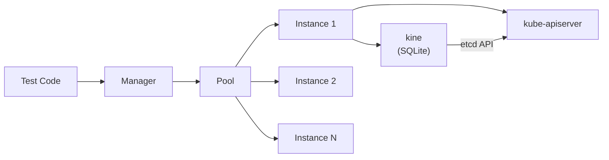
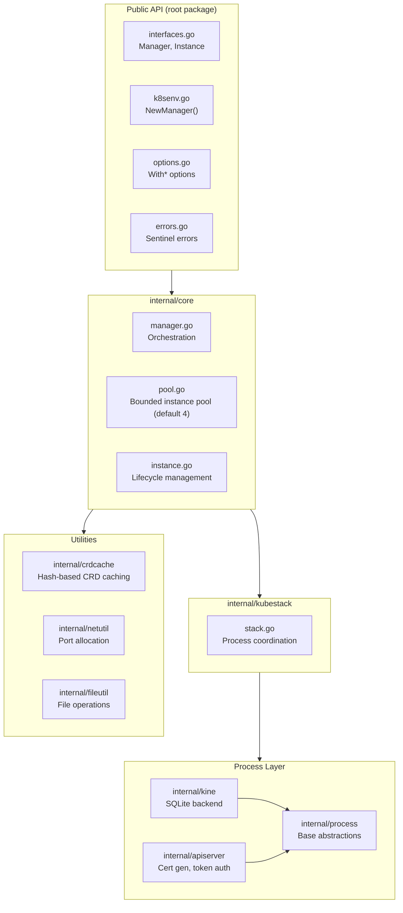

# Architecture Overview

k8senv is a lightweight Kubernetes testing framework that manages on-demand kube-apiserver instances backed by kine (an etcd-compatible SQLite shim). It provides fast, isolated API server environments for integration testing.

## Design Principles

- **Lazy initialization**: Instances don't start until first acquired, speeding up test suite setup
- **On-demand instances**: Instances are created as needed and reused when released, reducing resource overhead
- **Two-phase lifecycle**: Construction (`NewManager`) is pure; I/O happens in `Initialize()`, enabling clean error handling
- **API-only mode**: Runs only kube-apiserver (no scheduler or controller-manager), optimized for API testing

## System Context

Tests acquire instances from a shared pool. Each instance manages a coordinated pair of processes: kine provides an etcd-compatible API backed by SQLite, and kube-apiserver connects to kine as its storage backend.

## Layer Architecture

The library follows a strict layering: public API wraps `internal/core`, which delegates process management to `internal/kubestack`, which coordinates the individual process implementations.

## Key Components

### Manager

Orchestrates the pool lifecycle. Handles two-phase initialization (construction + `Initialize()`), delegates instance acquisition to the pool, and manages graceful shutdown.

### Pool

Instance management safe for concurrent use by multiple goroutines, with on-demand creation. `Acquire()` creates a new instance or reuses a previously released one, returning a token for double-release detection. `Release()` applies the configured `ReleaseStrategy` and returns the instance to the pool.

### Instance

Manages the lifecycle of a kine + kube-apiserver pair. Supports lazy start (first `Acquire()` triggers startup), port conflict retry, and strategy-based release (restart, namespace cleanup, or no-op).

### KubeStack

Coordinates the startup sequence: starts kine first, waits for TCP readiness, then starts kube-apiserver. Handles orderly shutdown in reverse.

### CRD Cache

Hash-based caching system that pre-applies CRDs to a SQLite database during `Initialize()`. Uses double-checked locking with file-based locks to support concurrent cache creation safely. Cache key is the SHA256 hash of the CRD directory contents.

## Technology Choices

| Choice | Rationale |
|--------|-----------|
| kine (SQLite) over etcd | Faster startup, no separate etcd process, simpler dependency |
| On-demand instance creation | No pre-allocation needed, scales with test parallelism |
| Token-based auth | Simple for testing; no certificate authority needed for client auth |
| Self-signed TLS | kube-apiserver requires TLS; ephemeral certs are sufficient for tests |
| Dynamic port allocation | Avoids conflicts when running multiple instances or parallel CI jobs |
| Two-phase init | Enables error handling (vs. panics) and context-aware cancellation |

## Design Decisions

### API-Only Mode

Scheduler and controller-manager are not run. Pods remain Pending and controllers don't reconcile, but this is ideal for testing CRDs, RBAC, namespaces, ConfigMaps, Secrets, and admission webhooks.

### Release Strategies

Release behavior is configured once at the manager level via `WithReleaseStrategy()`, not per-call:

- **`ReleaseRestart`** (default) — Stops the instance on release. Next `Acquire()` starts a fresh instance with the DB restored from template. Provides full isolation between tests.
- **`ReleaseClean`** — Deletes non-system namespaces but keeps the instance running. Faster reuse (~100ms vs ~5-15s restart), but shared state in system namespaces persists.
- **`ReleaseNone`** — No cleanup. Returns the instance as-is. Fastest, but tests must manage their own isolation.

### Lazy Initialization

Instances don't start kine and kube-apiserver until first acquired via `Acquire()`. Startup cost is paid only when tests actually need instances.

## Further Reading

- [Data Flow](../reference/data-flow.md) — Request lifecycle and CRD caching sequence
- [Directory Structure](../reference/directory-structure.md) — File organization and purposes
- [CODEBASE_MAP.md](../CODEBASE_MAP.md) — Auto-generated detailed module guide
