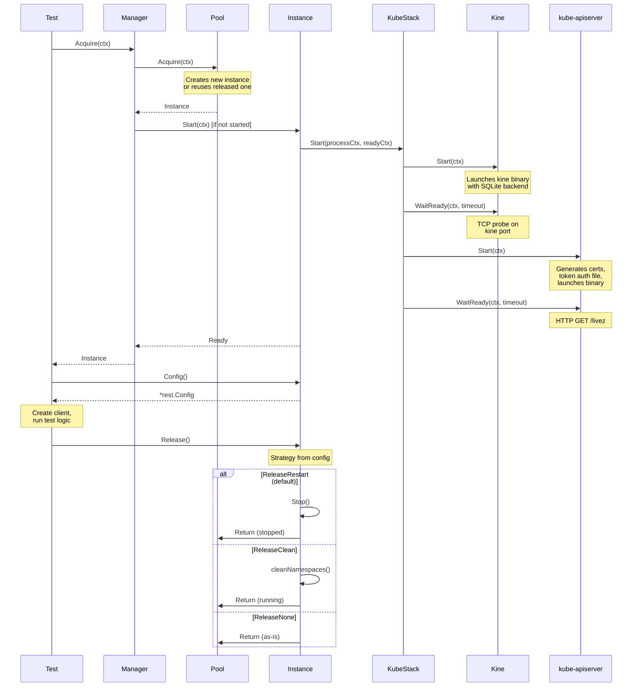
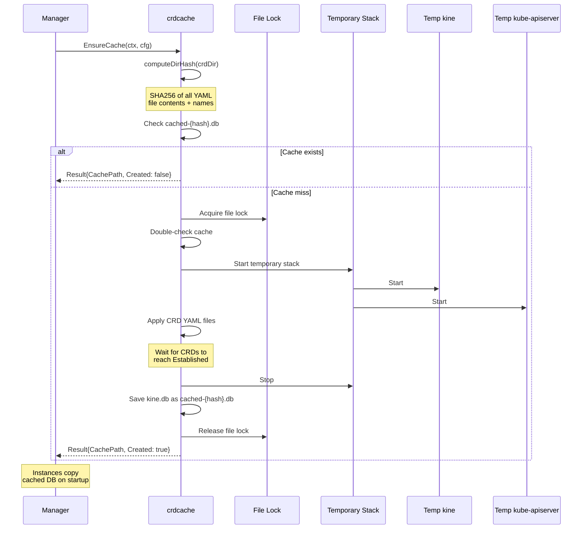
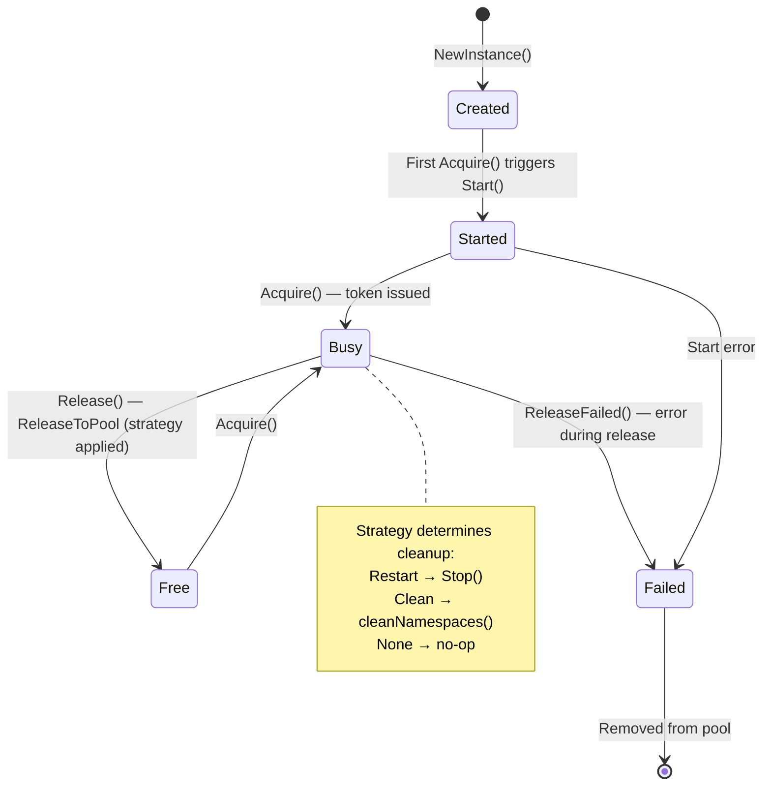

# Data Flow

This document describes how requests flow through k8senv during test execution and CRD cache creation.

## Test Request Lifecycle

## Instance Startup Sequence

Each instance starts two coordinated processes:

1. **kine** starts first — provides etcd-compatible API backed by SQLite on a dynamic port
2. **TCP readiness probe** — polls kine's port until it accepts connections
3. **kube-apiserver** starts second — connects to kine as its etcd backend
4. **HTTP health check** — polls `/livez` endpoint until the API server is alive

If either process fails to start (e.g., port conflict), the instance retries with new ports (up to 5 attempts by default).

## CRD Cache Creation

## Pool Mechanics

The pool manages instances with a bounded capacity (default: 4):

- **Acquire**: Returns a previously released instance if available, or creates a new one (up to the pool size limit). Blocks if all instances are in use. Returns a token for double-release detection.
- **Release()**: Behavior depends on the manager's `ReleaseStrategy`:
  - `ReleaseRestart` (default) — Stops instance. Next acquire starts fresh.
  - `ReleaseClean` — Deletes non-system namespaces, keeps running.
  - `ReleaseNone` — No cleanup, returns as-is.
- **Failed**: Instance release or startup failed; instance is removed from the pool.

## Related

- [Architecture Overview](../explanation/architecture-overview.md) - Design principles and component descriptions
- [Directory Structure](directory-structure.md) - File organization and purposes
- [CRD Testing](../how-to/crd-testing.md) - Using the CRD cache in tests
