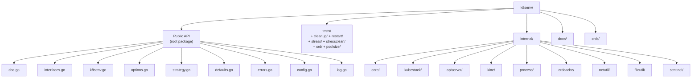

# Directory Structure

## Project Layout



## File Reference

### Public API (root package)

| File | Purpose |
|------|---------|
| `doc.go` | Package documentation with usage examples |
| `interfaces.go` | `Manager` and `Instance` interfaces |
| `k8senv.go` | `NewManager()` factory function, adapter wrappers |
| `options.go` | Functional options: `WithReleaseStrategy`, `WithCRDDir`, `WithAcquireTimeout`, etc. |
| `strategy.go` | `ReleaseStrategy` type alias + constants (`ReleaseRestart`, `ReleaseClean`, `ReleaseNone`) |
| `defaults.go` | Exported default constants (timeouts, binary names, strategy) |
| `errors.go` | Sentinel error re-exports from internal/core |
| `config.go` | Unexported `managerConfig` struct + conversion to `core.ManagerConfig` |
| `log.go` | `SetLogger()` public logging API |

### internal/core/ — Orchestration

| File | Purpose |
|------|---------|
| `manager.go` | Manager implementation: pool lifecycle, two-phase init, Acquire returns token |
| `pool.go` | Bounded instance pool (default 4), token-based double-release detection |
| `instance.go` | Instance lifecycle: strategy-based Release(), start, stop, port conflict retry |
| `cleanup.go` | Namespace cleanup: parallel deletion, finalizer removal |
| `config.go` | `ManagerConfig`, `InstanceConfig`, `ReleaseStrategy` type with `Validate()` |
| `log.go` | Package-level slog logger with atomic pointers |

### internal/kubestack/ — Process Stack

| File | Purpose |
|------|---------|
| `stack.go` | Coordinates kine + kube-apiserver startup/shutdown sequence |

### internal/apiserver/ — kube-apiserver Process

| File | Purpose |
|------|---------|
| `process.go` | Certificate generation, token auth, kube-apiserver binary management |

### internal/kine/ — kine Process

| File | Purpose |
|------|---------|
| `process.go` | SQLite backend configuration, DB prepopulation, TCP readiness |

### internal/process/ — Base Abstractions

| File | Purpose |
|------|---------|
| `base.go` | `BaseProcess`: embeddable process lifecycle (setup, start, stop) |
| `process.go` | `LogFiles` management, port conflict detection |
| `stoppable.go` | `Stoppable` interface, cleanup helpers |
| `wait.go` | Polling-based readiness checks with configurable intervals |

### internal/crdcache/ — CRD Cache

| File | Purpose |
|------|---------|
| `cache.go` | `EnsureCache`: double-checked locking, cache creation |
| `apply.go` | Dynamic YAML resource application to kube-apiserver |
| `hash.go` | Deterministic SHA256 directory hashing |
| `lock.go` | File-based locking (gofrs/flock) |
| `walk.go` | Recursive YAML file discovery |

### internal/netutil/ — Network Utilities

| File | Purpose |
|------|---------|
| `port.go` | `PortRegistry`: `AllocatePortPair()`, reserve/release tracking |

### internal/fileutil/ — File Utilities

| File | Purpose |
|------|---------|
| `copy.go` | `CopyFile` with chmod and fsync |
| `dir.go` | `EnsureDir`, `EnsureDirForFile` |

### internal/sentinel/ — Sentinel Error Type

| File | Purpose |
|------|---------|
| `sentinel.go` | `const`-compatible error type for sentinel errors |

### tests/ — Core Integration Tests (package `k8senv_test`)

| File | Purpose |
|------|---------|
| `main_test.go` | `TestMain`: singleton manager, binary validation, signal handling |
| `instance_test.go` | Instance usage, reuse, ID uniqueness, double-release, API server mode |
| `pool_test.go` | Pool acquire/release semantics and concurrent access |
| `lifecycle_test.go` | Initialize idempotency and concurrency tests |
| `coverage_test.go` | Context cancel coverage |

### tests/cleanup/ — Namespace Cleanup Tests (package `k8senv_cleanup_test`)

| File | Purpose |
|------|---------|
| `main_test.go` | `TestMain`: singleton with `WithReleaseStrategy(ReleaseClean)` |
| `cleanup_test.go` | System NS match, cleanup, preserve, no-user-NS fast path |

### tests/restart/ — Restart Strategy Tests (package `k8senv_restart_test`)

| File | Purpose |
|------|---------|
| `main_test.go` | `TestMain`: singleton with default `ReleaseRestart` strategy |
| `restart_test.go` | Release stops instance, next Acquire starts fresh |

### tests/stress/ — Stress Tests (package `k8senv_stress_test`)

| File | Purpose |
|------|---------|
| `main_test.go` | `TestMain`: singleton with default strategy |
| `stress_test.go` | 100+ parallel subtests with random resource creation |

### tests/stressclean/ — Stress Tests with ReleaseClean (package `k8senv_stressclean_test`)

| File | Purpose |
|------|---------|
| `main_test.go` | `TestMain`: singleton with `WithReleaseStrategy(ReleaseClean)` |
| `stress_test.go` | Stress + verify clean instances on acquire |

### tests/crd/ — CRD Tests (package `k8senv_crd_test`)

| File | Purpose |
|------|---------|
| `main_test.go` | `TestMain`: singleton with `WithCRDDir` |
| `crd_test.go` | CRD caching, multi-CRD, multi-doc YAML, .yml extension |
| `helpers_test.go` | CRD-specific helpers + `verifyCRDExists` |
| `testdata_test.go` | CRD YAML constants and `setupSharedCRDDir()` |

### tests/poolsize/ — Pool Size Tests (package `k8senv_poolsize_test`)

| File | Purpose |
|------|---------|
| `main_test.go` | `TestMain`: singleton with `WithPoolSize(2)` |
| `poolsize_test.go` | Pool timeout, release unblocking, bounded instance reuse |

### tests/internal/testutil/ — Shared Test Helpers

| File | Purpose |
|------|---------|
| `testutil.go` | `UniqueName`, `AcquireWithClient`, `RunTestMain`, `SetupTestLogging` |
| `stress.go` | Stress test helpers: `StressCreateRandomResource`, `StressSubtestCount` |

### Runtime Data Directory

Instance data is created at runtime under the base data directory (default `/tmp/k8senv/`):

```
/tmp/k8senv/
├── cached-abc123.db              # CRD cache (persistent across runs)
├── inst-a1b2c3d4/               # Instance data directory
│   ├── kine.db                  # SQLite database
│   ├── kine-stdout.log          # kine stdout
│   ├── kine-stderr.log          # kine stderr
│   ├── kube-apiserver-stdout.log
│   ├── kube-apiserver-stderr.log
│   ├── apiserver.crt            # Self-signed TLS certificate
│   ├── apiserver.key            # TLS private key
│   └── token-auth               # Token authentication file
```

## Related

- [Architecture Overview](../explanation/architecture-overview.md) - Layer architecture and component descriptions
- [Data Flow](data-flow.md) - How requests flow through the system
- [CODEBASE_MAP.md](../CODEBASE_MAP.md) - Auto-generated detailed module guide
