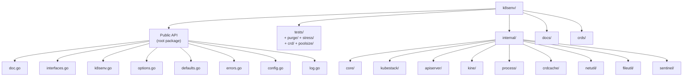

# Directory Structure

## Project Layout


```mermaid
flowchart TD
    Root["k8senv/"] --> Public["Public API\n(root package)"]
    Root --> Tests["tests/\n+ purge/ + stress/\n+ crd/ + poolsize/"]
    Root --> Internal["internal/"]
    Root --> Docs["docs/"]
    Root --> CRDs["crds/"]

    Public --> doc["doc.go"]
    Public --> ifaces["interfaces.go"]
    Public --> factory["k8senv.go"]
    Public --> opts["options.go"]
    Public --> defs["defaults.go"]
    Public --> errs["errors.go"]
    Public --> cfg["config.go"]
    Public --> log["log.go"]

    Internal --> Core["core/"]
    Internal --> KubeStack["kubestack/"]
    Internal --> APIServerPkg["apiserver/"]
    Internal --> KinePkg["kine/"]
    Internal --> Process["process/"]
    Internal --> CRDCachePkg["crdcache/"]
    Internal --> NetUtil["netutil/"]
    Internal --> FileUtil["fileutil/"]
    Internal --> Sentinel["sentinel/"]
```

## File Reference

### Public API (root package)

| File | Purpose |
|------|---------|
| `doc.go` | Package documentation with usage examples |
| `interfaces.go` | `Manager` and `Instance` interfaces |
| `k8senv.go` | `NewManager()` factory function, adapter wrappers |
| `options.go` | Functional options: `WithCRDDir`, `WithAcquireTimeout`, `WithPoolSize`, etc. |
| `defaults.go` | Exported default constants (timeouts, binary names, pool size) |
| `errors.go` | Sentinel error re-exports from internal/core |
| `config.go` | Unexported `managerConfig` struct + conversion to `core.ManagerConfig` |
| `log.go` | `SetLogger()` public logging API |

### internal/core/ — Orchestration

| File | Purpose |
|------|---------|
| `manager.go` | Manager implementation: pool lifecycle, two-phase init, Acquire returns token |
| `pool.go` | Bounded instance pool (default 4), token-based double-release detection |
| `instance.go` | Instance lifecycle: Release() with SQLite purge, start, stop, port conflict retry |
| `namespace.go` | System namespace definitions and helpers |
| `purge.go` | Namespace cleanup via direct SQLite queries: bypasses API and finalizers |
| `config.go` | `ManagerConfig`, `InstanceConfig` with `Validate()` |
| `log.go` | Package-level slog logger with atomic pointers |

### internal/kubestack/ — Process Stack

| File | Purpose |
|------|---------|
| `stack.go` | Coordinates kine + kube-apiserver startup/shutdown sequence |

### internal/apiserver/ — kube-apiserver Process

| File | Purpose |
|------|---------|
| `process.go` | Certificate generation, token auth, kube-apiserver binary management |

### internal/kine/ — kine Process

| File | Purpose |
|------|---------|
| `process.go` | SQLite backend configuration, DB prepopulation, TCP readiness |

### internal/process/ — Base Abstractions

| File | Purpose |
|------|---------|
| `base.go` | `BaseProcess`: embeddable process lifecycle (setup, start, stop) |
| `base_linux.go` | Linux-specific process group and signal handling |
| `base_other.go` | Non-Linux (macOS, Windows) process signal handling |
| `process.go` | `logFiles` management, process stop sequence |
| `stoppable.go` | `Stoppable` interface, cleanup helpers |
| `wait.go` | Polling-based readiness checks with configurable intervals |

### internal/crdcache/ — CRD Cache

| File | Purpose |
|------|---------|
| `cache.go` | `EnsureCache`: double-checked locking, cache creation |
| `apply.go` | Dynamic YAML resource application to kube-apiserver |
| `hash.go` | Deterministic SHA256 directory hashing |
| `lock.go` | File-based locking (gofrs/flock) |
| `walk.go` | Recursive YAML file discovery |

### internal/netutil/ — Network Utilities

| File | Purpose |
|------|---------|
| `port.go` | `PortRegistry`: `AllocatePortPair()`, reserve/release tracking |

### internal/fileutil/ — File Utilities

| File | Purpose |
|------|---------|
| `copy.go` | `CopyFile` with chmod and fsync |
| `dir.go` | `EnsureDir`, `EnsureDirForFile` |

### internal/sentinel/ — Sentinel Error Type

| File | Purpose |
|------|---------|
| `sentinel.go` | `const`-compatible error type for sentinel errors |

### tests/ — Core Integration Tests (package `k8senv_test`)

| File | Purpose |
|------|---------|
| `main_test.go` | `TestMain`: singleton manager, binary validation, signal handling |
| `instance_test.go` | Instance usage, reuse, ID uniqueness, double-release, API server mode |
| `pool_test.go` | Pool acquire/release semantics and concurrent access |
| `lifecycle_test.go` | Initialize idempotency and concurrency tests |
| `context_test.go` | Context cancel coverage |

### tests/stress/ — Stress Tests (package `k8senv_stress_test`)

| File | Purpose |
|------|---------|
| `main_test.go` | `TestMain`: singleton manager setup |
| `stress_test.go` | 100+ parallel subtests with random resource creation |

### tests/purge/ — SQLite Purge Tests (package `k8senv_purge_test`)

| File | Purpose |
|------|---------|
| `main_test.go` | `TestMain`: singleton manager setup |
| `purge_test.go` | Purge namespaces, preserve system NS, namespaced resources, finalizer bypass |

### tests/crd/ — CRD Tests (package `k8senv_crd_test`)

| File | Purpose |
|------|---------|
| `main_test.go` | `TestMain`: singleton with `WithCRDDir` |
| `crd_test.go` | CRD caching, multi-CRD, multi-doc YAML, .yml extension, resource cleanup on release |
| `helpers_test.go` | CRD-specific helpers + `verifyCRDExists` |
| `testdata_test.go` | CRD YAML constants and `setupSharedCRDDir()` |

### tests/poolsize/ — Pool Size Tests (package `k8senv_poolsize_test`)

| File | Purpose |
|------|---------|
| `main_test.go` | `TestMain`: singleton with `WithPoolSize(2)` |
| `poolsize_test.go` | Pool timeout, release unblocking, bounded instance reuse |

### tests/internal/testutil/ — Shared Test Helpers

| File | Purpose |
|------|---------|
| `testutil.go` | `SetupAndRun`, `SetupAndRunWithHook`, `AcquireWithClient`, `AcquireWithGuardedRelease`, `RunTestMain`, `SetupTestLogging`, `RequireBinariesOrExit`, `UniqueName`, `CreateNamespace`, `SystemNamespaces`, `TestParallel` |
| `release.go` | Shared release assertions: `ReleaseRemovesUserNamespaces`, `ReleasePreservesSystemNamespaces`, `ReleaseWithNoUserNamespaces`, `ReleaseRemovesNamespacedResources`, `ReleaseRemovesResourcesWithFinalizers`, `ReleasePreservesSystemNamespaceResources` |
| `stress.go` | Stress test helpers: `StressCreateRandomResource`, `StressSubtestCount` |

### Runtime Data Directory

Instance data is created at runtime under the base data directory (default `/tmp/k8senv/`):

```
/tmp/k8senv/
├── cached-abc123.db              # CRD cache (persistent across runs)
├── inst-a1b2c3d4/               # Instance data directory
│   ├── kine.db                  # SQLite database
│   ├── kine-stdout.log          # kine stdout
│   ├── kine-stderr.log          # kine stderr
│   ├── kube-apiserver-stdout.log
│   ├── kube-apiserver-stderr.log
│   ├── kubeconfig.yaml          # Generated kubeconfig for this instance
│   ├── token.csv                # Token authentication file
│   ├── auth-config.yaml         # Authentication configuration
│   └── certs/                   # Certificate directory
│       ├── apiserver.crt        # Self-signed TLS certificate (auto-generated)
│       ├── apiserver.key        # TLS private key (auto-generated)
│       └── sa.key               # Service account signing key
```

## Related

- [Architecture Overview](../explanation/architecture-overview.md) - Layer architecture and component descriptions
- [Data Flow](data-flow.md) - How requests flow through the system
- [CODEBASE_MAP.md](../CODEBASE_MAP.md) - Auto-generated detailed module guide
